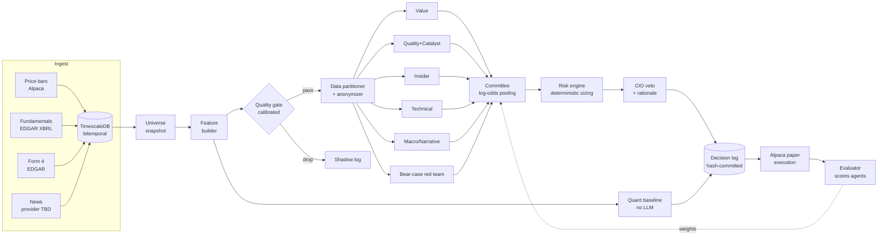

# Asymmetric Committee Fund — Architecture Blueprint v1

**Scope:** US equities · signals + Alpaca paper trading · OpenRouter LLM layer
**Built from:** GreymatterAI "AI Hedge Fund" teardown, redesigned to fix its methodological and engineering gaps
**Target builder:** Claude Code, phase-gated (see §17)
**Status:** Draft for review — 2026-09-25

---

## 0. Executive Summary

The original system has one good idea: **information asymmetry**. Each agent sees only its own data, so disagreement comes from the inputs rather than from role-played personas. This blueprint keeps that idea and fixes what surrounds it.

| # | Original weakness | Why it matters | Fix in this design |
|---|---|---|---|
| 1 | Blind backtest only time-locks the **database** | The LLM's *weights* already contain post-cutoff outcomes if the model's training cutoff is after the backtest date (parametric look-ahead bias). | Contamination-aware protocol (§12): evaluate only after every model's cutoff, anonymize entities, probe for memorization, and make forward paper trading the primary test. |
| 2 | n = 1 quarter, 20 hand-picked names | This is not statistically meaningful, and the sector picks (AI infra, nuclear, space) were chosen with hindsight. | Rules-based point-in-time universe (§4.4), walk-forward over many rebalance dates, bootstrap confidence intervals, and a Deflated Sharpe ratio. |
| 3 | "+1.01% vs S&P" while 77.5% cash | The wrong benchmark. At 22.5% equity exposure, holding SPY would have returned about −0.88% (assuming cash earned nothing). On that basis the stock picks *underperformed* by about 2 points. | Exposure-matched benchmark, plus a deterministic quant baseline and a random-committee control (§12.3). |
| 4 | The core thesis (asymmetry helps) is never tested | There is no evidence the architecture beats a simpler version. | Ablations: a symmetric-information control, leave-one-agent-out runs, and a non-LLM baseline (§12.5). |
| 5 | Agents are never scored | A bad agent gets the same vote forever. | Per-agent calibration (Brier score, information coefficient) with track-record-weighted pooling (§7). |
| 6 | The LLM CIO sizes positions | Sizing is unreproducible, uncalibrated and blind to sector. | Deterministic risk engine sizes positions. The CIO can only veto and write the rationale (§8). |
| 7 | Persona names (Buffett, Ackman…) | Invites the model to recall those investors' actual holdings and adds stylistic noise. | Strategy-named agents with explicit rubrics (§3). |
| 8 | Five production bugs found in integration | These are schema drift, dead weights, cache locks and rate limits. | Designed out up front: shared contracts, propagation tests, run-scoped idempotency, token buckets (§13). |

**Success criterion (pre-registered):** After at least 6 months of forward paper trading, the committee must beat **both** the exposure-matched SPY benchmark **and** the quant baseline, net of modeled costs, with the bootstrap 90% confidence interval on excess return excluding zero. If it does not, the LLM layer is not adding value, and that is a valid result.

---

## 1. Design Principles

1. **LLMs only where text matters.** News, filings and qualitative judgment go to LLMs. Price math, sizing and risk are deterministic code.
2. **Point-in-time everything.** Every record carries `available_at`, the moment it was knowable. Queries filter on `available_at <= as_of`, never on event date.
3. **Contracts before code.** One shared `contracts/` package (Pydantic v2) defines every inter-stage message. Producers and consumers import the same enums.
4. **Every decision is replayable.** Store inputs, prompt version, served model ID, raw output and parsed output. A run is identified by `run_id` and fully reconstructable.
5. **Commit before you look.** Decisions are hashed and written to an append-only log before any outcome data is loaded.
6. **The baseline is a first-class citizen.** A non-LLM quant agent runs on every cycle, and the LLM stack must beat it.

---

## 2. System Overview



---

## 3. Agent Roster

Agents are named by **strategy, not by person**. Each agent receives an anonymized entity by default. It sees `TICKER_07` in the `Semiconductor equipment` sector with `Mid-cap` size, not the company's name.

| Agent | Type | Sees | Blinded to | Output focus |
|---|---|---|---|---|
| **Value** | LLM | Fundamentals (as-filed XBRL, TTM, 5-year history), sector medians | Price, news, insiders, identity | Intrinsic value vs implied valuation; margin of safety |
| **Quality + Catalyst** | LLM | Fundamentals + news (entity-masked) | Price, insiders | Business quality and whether a catalyst exists |
| **Insider** | LLM | Fundamentals + Form 4 transactions (role, size vs holdings, clustering, 10b5-1 flag) | Price, news | Informed-buying signal strength |
| **Technical** | Hybrid | Engineered price/volume features (trend, momentum, realized vol, drawdown, volume z-score, distance to 52-week high) | Everything else, identity | The LLM *interprets* computed features. It never reads raw candles. |
| **Macro / Narrative** | LLM | Price features + news + market regime features (SPY trend, VIX proxy, rates) | Fundamentals, insiders | Whether narrative and regime align with the price trend |
| **Bear-case red team** | LLM | **All** partitions | — | Required to argue *against* a long position. Its output adjusts sizing but does not count as a vote (see §7). |
| **Quant baseline** | Deterministic | Features only | — | Cross-sectional value + momentum + quality composite. It is the control. |

**Why add the Technical-as-features design:** Studies of LLMs reading raw OHLCV find they add little beyond standard factor math. Feeding pre-computed features cuts tokens by about 90% and removes a source of hallucinated support/resistance levels.

**Why a red team:** Asymmetric agents disagree about *direction* but share a bullish bias toward emerging-sector names. A dedicated adversary sees all the evidence and must produce the strongest bear case. This directly targets the "everyone likes the AI stock" failure mode.

### 3.1 Agent output contract

```python
class Stance(str, Enum):
    STRONG_SELL = "strong_sell"; SELL = "sell"; HOLD = "hold"; BUY = "buy"; STRONG_BUY = "strong_buy"

class AgentVerdict(BaseModel):
    run_id: UUID
    agent: AgentName            # shared enum
    entity_token: str           # anonymized id, e.g. "TICKER_07"
    as_of: datetime
    stance: Stance
    p_outperform: confloat(ge=0, le=1)   # P(beats sector ETF over horizon)
    horizon_days: Horizon       # IntEnum: 21 | 63
    key_evidence: conlist(EvidenceRef, min_length=1, max_length=5)  # must cite input rows
    risks: conlist(str, max_length=3)
    data_sufficiency: DataSufficiency   # enum: full | partial | insufficient
    prompt_version: str
    model_served: str           # from response.model, NOT the requested model
    valid: bool                 # system-computed backtest-cutoff validity
```

**LLM-authored vs system-filled.** Only `stance`, `p_outperform`, `horizon_days`, `key_evidence`, `risks` and `data_sufficiency` come from the model (`AgentVerdictLLM`). `run_id`, `agent`, `entity_token`, `as_of`, `prompt_version`, `model_served` and `valid` are filled in by `agents/base.py`. Validity is a boolean on each agent and red-team verdict, rather than an enum or a separate evaluation record, because this decision has only two outcomes and must travel with the verdict that the committee may include or exclude. The strict `response_format` schema (§10.2) is the schema of `AgentVerdictLLM`, so the LLM can never write `model_served` or `valid`. `RedTeamVerdict` uses the same split; `CioDecision` has no validity field.

The model-cutoff rule applies only when `Run.mode` is `RunMode.BACKTEST`: the system sets `valid=False` when the verdict's served model makes the backtest window invalid, and otherwise sets `valid=True`. Live and ablation runs always set `valid=True`; their suitability is handled by their respective evaluation protocol rather than overloading verdict validity.

`p_outperform` is the scored quantity. Asking for a probability instead of "confidence 0–100" makes calibration measurable. `key_evidence` must reference row IDs from the input partition, and the validator rejects citations to data the agent was not given. This catches leaks from the model's memory.

---

## 4. Data Layer

### 4.1 Sources

| Feed | Source | Cadence | Notes |
|---|---|---|---|
| Daily bars | Alpaca Market Data | EOD + 15-minute delayed intraday | The free plan's real-time feed is IEX only (about 2–3% of volume). SIP data older than 15 minutes is available on free. Use daily bars, so free is sufficient. |
| Fundamentals | SEC EDGAR `companyfacts` XBRL | Daily poll | Free, no key. **Store as-filed values keyed by filing date. Never overwrite with restatements.** |
| Insider trades | SEC EDGAR Form 4 (submissions JSON + XML) | Daily | `available_at` is the **filing** timestamp, not the transaction date. The two can differ by about 2 business days, and using transaction date is look-ahead. |
| News | Alpaca News or Alpha Vantage `NEWS_SENTIMENT` | 15 min | Must expose publish timestamps. Reject sources that back-edit articles without versioning. |
| Regime | SPY/IWM bars, ^VIX proxy (VIXY or computed), 10Y yield (FRED) | Daily | Macro agent only |

**EDGAR compliance:** keep a global token bucket at 8 requests per second across all workers (the SEC limit is 10/s per user across all machines). Set `User-Agent: AsymmetricCommittee/1.0 (you@domain)`. Violations cause roughly 10-minute IP blocks.

### 4.2 Bitemporal storage

Every fact table has:

| Column | Meaning |
|---|---|
| `event_time` | When it happened (period end, trade date, publish time) |
| `available_at` | When *we* could have known it (filing accepted time, ingest time for live feeds) |
| `ingested_at` | When our system recorded it |
| `source_version` | Filing accession or article revision |

The canonical query helper is `as_of(table, ts)`, which returns rows `WHERE available_at <= ts` with the latest `source_version` per key as of `ts`. **No other read path is allowed in agent code.** Enforce this with a lint rule or repository wrapper.

### 4.3 Tables (TimescaleDB)

```
securities            (security_id, ticker, cik, name, sector, industry, listed_from, listed_to)
universe_snapshots    (snapshot_date, security_id, mcap_tier, adv_usd, included bool)   -- survivorship-safe
price_bars            hypertable (security_id, event_time, o,h,l,c,v, feed, available_at)
fundamentals_asfiled  (security_id, concept, unit, period_start, period_end, fiscal_period, form, value, accession, available_at)
insider_txns          (security_id, filer, role, txn_date, code, shares, price, post_holdings, is_10b5_1, accession, available_at)
news_items            (item_id, security_ids[], published_at, headline, summary, body_hash, source, available_at, revision)
features              hypertable (security_id, as_of, feature_set_version, jsonb)
runs                  (run_id, mode[live|backtest|ablation], as_of, config_hash, status, started_at, ended_at)
gate_decisions        (run_id, security_id, score, passed, components jsonb)
agent_verdicts        (run_id, security_id, agent, verdict jsonb, tokens_in, tokens_out, cost_usd, latency_ms)
committee_decisions   (run_id, security_id, pooled_p, dispersion, target_weight, cio_action, rationale)
decision_commitments  (run_id, sha256, committed_at)   -- append-only
orders / fills        (run_id, broker_order_id, ..., slippage_bps)
outcomes              (run_id, security_id, horizon, fwd_return, sector_fwd_return, scored_at)
agent_scores          (agent, window, brier, ic, hit_rate, n)   -- rolling
feed_health           (feed, last_success_at, last_available_at, rows, last_error)   -- freshness SLA (§13)
```

Every fact table also carries the §4.2 columns (`event_time`, `available_at`, `ingested_at`, `source_version`). `period_start` is needed because quarterly and year-to-date facts share `period_end` and accession.

That is 15 tables versus 7. The additions are what make the evaluation honest.

### 4.4 Universe (replaces the hand-picked 20)

This is rules-based and snapshotted monthly:

1. Take US-listed common stocks in the chosen sector set. Configure the sectors, and **freeze the list before the evaluation window**.
2. Require market cap between $500M and $50B, 20-day average dollar volume ≥ $10M, and price ≥ $5.
3. Rank by a liquidity-adjusted score and take the top N (start with N = 40).
4. Store the snapshot. Delisted names stay in historical snapshots.

---

## 5. Feature Builder

Deterministic, versioned (`feature_set_version`), and computed from `as_of()` reads only.

- **Price:** 1/3/6/12-month returns (skip the latest month for 12-1 momentum), 20/50/200-day SMA distances, 20-day realized vol, ATR%, max drawdown over 63 days, volume z-score, distance to 52-week high
- **Fundamental:** EV/Sales, EV/EBIT, FCF yield, gross margin trend, revenue growth (YoY, 3-year CAGR), net debt/EBITDA, share-count change, accruals ratio
- **Insider:** net open-market buy $ over 90 days (excluding 10b5-1 plans), number of distinct insider buyers, CEO/CFO buy flag
- **News:** article count z-score over 7 days, source diversity. Sentiment is left to the LLM agents.
- **Sector-relative:** each fundamental metric also as a percentile within its sector in the current universe snapshot

---

## 6. Quality Gate (replaces the fixed 0.35 "bouncer")

- **Score:** a logistic model on features, predicting P(|sector-relative 21-day return| is in the top tercile). The gate asks "is there likely to be *something* here", not "is it bullish".
- **Threshold:** set so the gate passes K names per run (start with K = 15), which fixes the LLM budget.
- **Shadow evaluation:** dropped names are scored on outcomes too. Track gate recall monthly. If dropped names later move as much as passed names, the gate is useless and should be removed.
- **Refit:** walk-forward only, trained on data before each `as_of`.

---

## 7. Committee Aggregation

**Pooling:** logit-weighted average of each voting agent's `p_outperform`:

```
logit(p_pool) = Σ w_a · logit(clip(p_a, 0.02, 0.98)) / Σ w_a
w_a = max(w_floor, skill_a)          # skill from rolling Brier improvement vs 0.5 baseline
w_a = 0 if data_sufficiency == "insufficient"
```

- **Cold start:** equal weights until each agent has at least 100 scored verdicts.
- **Dispersion:** the standard deviation of agent logits. High disagreement shrinks the position size (§8). Disagreement is information, not noise to average away.
- **Red team:** does not vote. It outputs `bear_severity ∈ {low, med, high}` plus a specific falsifiable risk. `high` halves the target weight, and it is logged so the red team gets scored too (was the named risk realized?).
- **Weight propagation test** (fixes original bug #2): an integration test asserts that every agent's weight is non-zero after pooling and that changing any single agent's `p` changes `p_pool`.

---

## 8. Risk Engine and CIO

### 8.1 Deterministic sizing

```
edge      = p_pool − 0.5
raw_w     = k · edge / σ_20d          # vol-scaled conviction
w         = raw_w · (1 − λ·dispersion) · bear_multiplier
w         = clip(w, 0, max_position)
```

| Constraint | Default |
|---|---|
| Long-only (phase 1) | yes |
| Max single position | 8% |
| Max sector | 30% |
| Portfolio vol target | 12% annualized (scale gross exposure) |
| Min position (else 0) | 1% |
| Entry threshold | `p_pool ≥ 0.56` |
| Cash | the **residual**, not a CIO choice. A high cash level is visible and explainable. |

**Sector normalization** (fixes original bug #3): valuation features enter the agents as sector percentiles, and the risk engine's vol scaling uses each name's own σ. No global "blue-chip" thresholds exist anywhere.

### 8.2 CIO agent (LLM, strongest model tier)

- **Input:** the proposed book, the committee table and red-team notes
- **Allowed actions per name:** `approve`, `veto(reason)`, `flag_for_review`. It **cannot** change weights.
- **Veto budget:** at most 20% of proposed names per run. More than that raises an alert, because it means the CIO is miscalibrated (the original "100% rejection" bug).
- It writes a portfolio rationale for the dashboard.

---

## 9. Execution (Alpaca Paper)

- **Rebalance:** weekly, Monday after the open plus 30 minutes, using decisions committed from Friday's close data
- **Orders:** marketable limit orders at mid ± 10 bps, with a 15-minute time-in-force. Any remainder converts to market.
- **Logging:** decision price, arrival price, fill price and slippage in bps. Paper fills are simulated from quotes, so apply a **modeled cost** (spread/2 + 5 bps) in the evaluator as well.
- **Known paper gaps:** no dividends, no fill emails, and no market impact. The evaluator adds dividends from corporate-actions data.
- **Kill switch:** halt if daily loss > 3% or any data feed is stale beyond its SLA, and flatten on a manual command
- **Live trading:** out of scope. If added later, it requires human approval per rebalance and separate keys.

---

## 10. LLM Layer (OpenRouter)

### 10.1 Model tiers

| Tier | Used by | Selection criteria |
|---|---|---|
| **Fast** | Value, Quality, Insider, Technical, Macro | Cheap, supports `structured_outputs`, known training cutoff |
| **Strong** | Red team, CIO | Best reasoning, supports `structured_outputs` |
| **Probe** | Memorization tests (§12.1) | Same models as production |

Pin exact model slugs in `config/models.yaml` with each model's **stated training cutoff**. The evaluator reads that file to decide which backtest windows are valid.

### 10.2 Request policy

```python
extra_body = {
  "response_format": {"type": "json_schema",
                      "json_schema": {"name": "AgentVerdictLLM", "strict": True, "schema": VERDICT_SCHEMA}},  # contracts/schemas/,
  "provider": {"require_parameters": True,          # only route to endpoints that honor the schema
               "data_collection": "deny"},
  "models": [PRIMARY, FALLBACK],                    # fallback on outage/rate-limit
  "temperature": 0,
}
```

- **Record `response.model`.** A fallback silently changes which model answered. Scores are tracked per served model, and a fallback model with a *later* cutoff invalidates that verdict for backtests.
- **Rate limiting:** a Redis token bucket per model (requests and tokens). Celery workers acquire tokens before calling. Exponential backoff with jitter, capped at 3 retries, then the job goes to a dead-letter queue. The run does not stall.
- **Cache:** key = `sha256(agent, prompt_version, model, input_partition_hash)`. Identical inputs are never re-billed, and re-runs are deterministic.
- **Budget:** a per-run USD cap. Exceeding it aborts remaining agent calls and marks the run `PARTIAL`, so it can never be scored as complete.
- **Validation:** Pydantic parse → evidence-reference check → range checks. One repair attempt, then the verdict is discarded as `invalid`.

### 10.3 Prompting

- One system prompt per agent with an explicit rubric: what counts as evidence, what "insufficient data" means, and the scoring horizon
- Inputs rendered as compact tables (TSV/TOON), never raw JSON dumps
- Prompts are versioned files (`prompts/value/v3.md`). Any change bumps `prompt_version` and resets that agent's score window.

---

## 11. Orchestration

- **Stack:** FastAPI (control and read API), Celery + Redis (tasks), TimescaleDB, Next.js dashboard, Docker Compose
- **Scheduler:** Celery beat runs the ingestion jobs and a weekly `run_pipeline(as_of=Friday_close)`
- **Run state machine:** `PENDING → INGEST_OK → FEATURES_OK → GATED → AGENTS_OK → COMMITTED → EXECUTED → SCORED`, plus the terminal states `FAILED` and `PARTIAL`
- **Idempotency** (fixes original bug #5): task keys are `(run_id, stage, security_id)`. Only a `COMPLETED` key short-circuits. `FAILED` or `PARTIAL` keys are retried. A new run always gets a new `run_id`, so stale locks from old runs can never block it. `POST /runs/{id}/reset` clears that run's keys only.

---

## 12. Evaluation Protocol

This section is the main reason this design is better. Treat it as the spec, not an afterthought.

### 12.1 Contamination control

1. **Valid backtest window** = strictly after the latest stated training cutoff among all models used, plus a 60-day buffer. Stated cutoffs are not fully reliable, so also run step 3.
2. **Entity anonymization:** agents never see the ticker or company name. Named people in news are masked as well.
3. **Memorization probe:** before each backtest, for each (model, security, window), ask a date-only recall question such as "Did [TICKER] outperform the S&P 500 between [date] and [date]?" If the probe's accuracy beats chance at p < 0.05, flag the window as contaminated and exclude it.
4. **Primary evidence is forward paper trading.** Backtests are for debugging and ablations. Claims come from the forward log only.

### 12.2 Walk-forward protocol

- Weekly rebalance dates across the valid window. Each date is an independent run with its own `as_of`.
- The gate model and agent weights update using only data before that date.
- Decisions are hashed into `decision_commitments` before `outcomes` are computed. The evaluator refuses to score runs without a commitment row.

### 12.3 Benchmarks (all computed every run)

| Benchmark | Purpose |
|---|---|
| SPY | Headline reference |
| **Exposure-matched SPY** | SPY × (portfolio gross exposure) + T-bill on cash. This is the fair comparison. |
| Equal-weight universe | Tests whether picking beats simply owning the universe |
| Sector-ETF-matched | Removes sector bets |
| **Quant baseline book** | Same risk engine, fed by the deterministic composite |
| **Random committee** | Same pipeline with agent verdicts shuffled across names. It measures the value of the architecture alone. |

### 12.4 Metrics

- **Portfolio:** CAGR, Sharpe, Sortino, max drawdown, turnover, cost drag, and excess return vs each benchmark
- **Signal:** information coefficient (Spearman correlation of `p_pool` with forward sector-relative return) per run, with its mean and t-stat
- **Agent:** Brier score, calibration curve, IC, hit rate, and share of `insufficient` outputs
- **Significance:** block-bootstrap confidence intervals on excess return. The **Deflated Sharpe Ratio** accounts for the number of configurations tried, so log every config you test.

### 12.5 Ablations (the thesis tests)

| Ablation | Question answered |
|---|---|
| **Symmetric info:** every agent sees all partitions | Does asymmetry actually help? |
| Leave-one-agent-out (×5) | Which agents carry weight? |
| No red team | Does the adversary improve risk-adjusted return? |
| Equal weights vs skill weights | Does track-record weighting help? |
| Strong model for all agents | Is the fast tier costing alpha? |
| Named vs anonymized entities | How much "performance" was memorization? |

---

## 13. Failure Modes — Designed Out

| Original bug | Prevention | Test |
|---|---|---|
| Regime keywords did not match the classifier enum | Single `contracts/` package, `Enum` types, `extra="forbid"` | Contract tests: every producer's output validates against every consumer's input model |
| Weighting system inactive | Weights computed and asserted in the pooling function | Propagation test (§7) |
| CIO rejected 100% of names | CIO cannot size. Sector-percentile inputs. Veto budget with an alert. | Replay test on a fixture book with expected veto rate < 20% |
| Rate-limit stalls | Per-model token bucket, fallback models, dead-letter queue, budget cap | Load test: 15 names × 6 agents with a mocked 429 storm finishes or goes `PARTIAL` within SLA |
| Stale cache → 0 stocks queued | Run-scoped idempotency keys | Test: a failed run followed by a new run queues all names |
| *New:* silent model swap via fallback | Log `model_served` and score per served model | Assertion in the evaluator |
| *New:* restated fundamentals leak | As-filed storage plus the `as_of()`-only read path | Property test: no row with `available_at > as_of` reaches any prompt |
| *New:* evidence hallucination | Evidence-reference validator | Fixture with injected fake citation → rejected |
| *New:* stale feed trades | Freshness SLA per feed | Kill-switch test |

---

## 14. Dashboard (Next.js)

| Panel | Shows |
|---|---|
| **Pipeline** | Run state machine, per-stage timings, cost, and any `PARTIAL`/`FAILED` reasons |
| **Opportunities** | Gated names: pooled p, dispersion, target weight, CIO action |
| **Committee matrix** | Agents × names heatmap of `p_outperform`, with each agent's evidence on click |
| **Agent leaderboard** | Rolling Brier score, IC and calibration curve per agent and per served model |
| **Performance** | Equity curve vs **all** §12.3 benchmarks, drawdown, and bootstrap CI band |
| **Ablations** | Side-by-side results from §12.5 |
| **Audit** | Decision-commitment hashes and a replay button per run |

---

## 15. Repository Layout

```
asymmetric-committee/
├── contracts/              # Pydantic models + enums (imported everywhere)
├── ingest/                 # alpaca.py, edgar_xbrl.py, edgar_form4.py, news.py
├── store/                  # schema.sql, as_of.py (only read path), migrations/
├── universe/               # snapshot builder
├── features/               # versioned feature sets
├── gate/                   # logistic gate + shadow eval
├── agents/
│   ├── base.py             # OpenRouter client, cache, token bucket, validation
│   ├── partitioner.py      # data isolation + anonymizer
│   ├── value.py … redteam.py, cio.py
│   └── quant_baseline.py
├── prompts/<agent>/vN.md
├── committee/              # pooling, dispersion
├── risk/                   # sizing, constraints
├── execution/              # alpaca paper, kill switch
├── evaluation/             # outcomes, benchmarks, metrics, bootstrap, DSR, probes, ablations
├── orchestration/          # celery app, beat schedule, run state machine
├── api/                    # FastAPI
├── dashboard/              # Next.js
├── config/                 # models.yaml, universe.yaml, risk.yaml
├── tests/                  # contract, propagation, point-in-time property, load
└── docker-compose.yml
```

---

## 16. Cost Envelope (per weekly run, estimate)

- 15 gated names × 5 fast-tier agents = 75 calls at about 3k input and 400 output tokens each
- 15 red-team calls + 1 CIO call on the strong tier
- With caching, that is typically a few dollars per run on mid-priced models. Verify against current OpenRouter pricing for the models you pin. Ablations multiply cost by about 6×, so run them on cached inputs.

---

## 17. Build Phases for Claude Code

Each phase has an acceptance gate. Do not start the next phase until the gate passes.

| Phase | Deliverable | Acceptance gate |
|---|---|---|
| **P0 Contracts** | `contracts/`, `config/`, docker-compose skeleton | All models round-trip. Enum contract tests pass. |
| **P1 Data** | Schema, `as_of()`, 4 ingestors, universe snapshots | Point-in-time property test passes. EDGAR limiter stays ≤ 8 rps under load. 2 years of history backfilled. |
| **P2 Features + gate + baseline** | Feature sets, logistic gate, quant baseline book | Baseline walk-forward runs end to end. Gate shadow log populated. |
| **P3 Agents** | Partitioner, anonymizer, 6 agents, OpenRouter client | No identity leak (fixture test). Structured outputs are 100% valid or repaired. 429-storm load test passes. |
| **P4 Committee + risk + CIO** | Pooling, sizing, CIO veto | Propagation test passes. Constraints hold under fuzzing. Veto rate < 20% on the fixture. |
| **P5 Orchestration + execution** | Celery state machine, Alpaca paper, kill switch | Failed-run → new-run idempotency test passes. Paper orders placed and reconciled. |
| **P6 Evaluation** | Benchmarks, metrics, bootstrap, DSR, memorization probe, ablation runner | The evaluator refuses uncommitted runs. All §12.3 benchmarks are computed. |
| **P7 Dashboard** | Next.js panels from §14 | Every panel renders from API data for a real run |
| **P8 Forward test** | Weekly schedule live on paper | Starts the 6-month pre-registered evaluation clock |

---

## 18. Open Decisions

1. **News source:** Alpaca News vs Alpha Vantage `NEWS_SENTIMENT`. Choose whichever gives reliable `published_at` timestamps and article revisions.
2. **Sector set** for the universe. Freeze it before P8.
3. **Horizon:** 21 vs 63 trading days as the primary scored horizon. Log both and pick one before P8.
4. **Short side:** phase 2 only, after long-only results exist.

---

## Sources

- OpenRouter structured outputs and `require_parameters`: https://openrouter.ai/docs/guides/features/structured-outputs
- OpenRouter provider routing and model fallbacks: https://openrouter.ai/docs/guides/routing/provider-selection
- Alpaca paper trading rules (IEX-only data, no dividends): https://docs.alpaca.markets/us/docs/paper-trading
- SEC EDGAR fair access (10 req/s): https://www.sec.gov/edgar/searchedgar/accessing-edgar-data.htm
- Gao, Jiang & Yan, *Detecting Lookahead Bias in LLM Forecasts*: https://arxiv.org/pdf/2512.23847
- *Summoning the Oracle to Slay It* (parametric look-ahead bias, FinCAD): https://arxiv.org/abs/2605.24564
- Glasserman & Lin, entity anonymization for GPT sentiment backtests: https://www.alphaxiv.org/abs/2309.17322v1
- Liang, *Look-Ahead Bias in Financial Forecasts Generated by LLMs*: https://papers.ssrn.com/sol3/papers.cfm?abstract_id=6772819

*Research and engineering design only. Not investment advice.*
