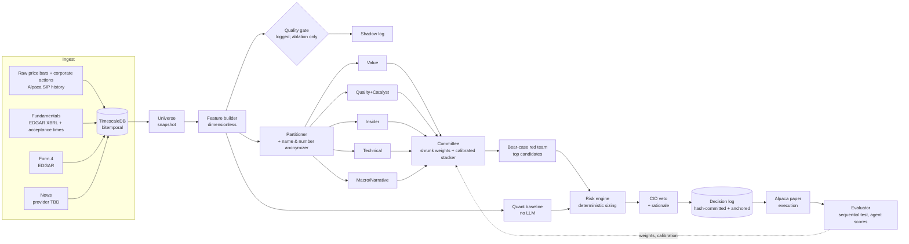

# Asymmetric Committee Fund — Architecture Blueprint v2

**Scope:** US equities · signals + Alpaca paper trading · OpenRouter LLM layer
**Built from:** GreymatterAI "AI Hedge Fund" teardown, redesigned to fix its methodological and engineering gaps
**Target builder:** Claude Code, phase-gated (see §17)
**Status:** v2, research-revised 2026-09-25. Supersedes v1. Every change is listed with its evidence in Appendix A. Claims that were researched but not adopted are in Appendix B.

---

## 0. Executive Summary

The original system has one good idea: **information asymmetry**. Each agent sees only its own data, so disagreement comes from the inputs rather than from role-played personas. This blueprint keeps that idea and fixes what surrounds it.

| # | Original weakness | Why it matters | Fix in this design |
|---|---|---|---|
| 1 | Blind backtest only time-locks the **database** | The LLM's *weights* already contain post-cutoff outcomes if the model's training cutoff is after the backtest date (parametric look-ahead bias). Masking names is not enough: in a 40-stock universe, raw financial figures identify the firm. | Contamination-aware protocol (§12.1): evaluate only after every model's *measured* knowledge cutoff, anonymize names **and numbers**, run recall, re-identification and date-transplant probes, and make forward paper trading the primary test. |
| 2 | n = 1 quarter, 20 hand-picked names | This is not statistically meaningful, and the sector picks (AI infra, nuclear, space) were chosen with hindsight. | Rules-based point-in-time universe (§4.4), survivorship-safe prices (§4.6), agents scoring the whole universe (§6), and a pre-registered sequential test (§12.6). |
| 3 | "+1.01% vs S&P" while 77.5% cash | The wrong benchmark. At 22.5% equity exposure, holding SPY would have returned about −0.88% (assuming cash earned nothing). On that basis the stock picks *underperformed* by about 2 points. | Exposure-matched benchmark, plus a deterministic quant baseline and a random-committee control (§12.3). |
| 4 | The core thesis (asymmetry helps) is never tested | There is no evidence the architecture beats a simpler version. | Ablations, including a single agent that sees everything and a same-budget self-consistency control (§12.5). |
| 5 | Agents are never scored | A bad agent gets the same vote forever. | Brier skill against the empirical base rate, with weights shrunk toward equal and a calibrated pooling layer (§7). |
| 6 | The LLM CIO sizes positions | Sizing is unreproducible, uncalibrated and blind to sector. | Deterministic risk engine sizes positions. The CIO can only veto and write the rationale (§8). |
| 7 | Persona names (Buffett, Ackman…) | Invites the model to recall those investors' actual holdings and adds stylistic noise. | Strategy-named agents with explicit rubrics (§3). |
| 8 | Five production bugs found in integration | These are schema drift, dead weights, cache locks and rate limits. | Designed out up front: shared contracts, propagation tests, run-scoped idempotency, token buckets (§13). |
| 9 | *v1 of this blueprint:* a fixed 6-month test with a bootstrap CI | About 26 weekly observations can only detect an edge of roughly 36% a year at 10% tracking error. A miss would have been misread as "no value". | Anytime-valid sequential test with three outcomes: PASS, FAIL, INCONCLUSIVE (§12.6). |

**Success criterion (pre-registered, §12.6):** the committee must beat **both** the exposure-matched SPY benchmark **and** the quant baseline, net of modeled costs, on weekly returns measured from the execution price.

- Each comparison is tested with an anytime-valid e-process at α = 0.05, so the threshold is an e-value of 20. Because both comparisons must succeed (an intersection–union test), no multiplicity correction is needed.
- The evaluation runs for at least 26 weeks and at most 104 weeks. Both limits are frozen before P8.
- There are three outcomes: **PASS**, **FAIL** (no value, shown only by the reverse e-process) and **INCONCLUSIVE**. An equivalence (TOST) statement is a diagnostic and never decides an outcome (§12.6).
- A short run will usually end INCONCLUSIVE, and that must never be reported as "no value".

---

## 1. Design Principles

1. **LLMs only where text matters.** News, filings and qualitative judgment go to LLMs. Price math, sizing and risk are deterministic code.
2. **Point-in-time everything.** Every record carries `available_at`, the moment it was knowable. Queries filter on `available_at <= as_of`, never on event date.
3. **Contracts before code.** One shared `contracts/` package (Pydantic v2) defines every inter-stage message. Producers and consumers import the same enums.
4. **Every decision is replayable.** Store inputs, prompt version, served model ID, raw output and parsed output. A run is identified by `run_id` and fully reconstructable.
5. **Commit before you look, and anchor it outside your own control.** Decisions are hashed and written to an append-only log before any outcome data is loaded. The hash is then anchored externally (OpenTimestamps and a public git remote), so not even the builder can rewrite it later.
6. **The baseline is a first-class citizen.** A non-LLM quant agent runs on every cycle, and the LLM stack must beat it.
7. **Measure, don't assume.** Knowledge cutoffs, calibration, agent error correlation and costs are measured from data. Vendor claims and LLM self-reports are never taken as fact.

---

## 2. System Overview


```mermaid
flowchart LR
  subgraph Ingest
    A1[Raw price bars + corporate actions<br/>Alpaca SIP history] --> DB
    A2[Fundamentals<br/>EDGAR XBRL + acceptance times] --> DB
    A3[Form 4<br/>EDGAR] --> DB
    A4[News<br/>provider TBD] --> DB
  end
  DB[(TimescaleDB<br/>bitemporal)] --> U[Universe<br/>snapshot]
  U --> F[Feature builder<br/>dimensionless]
  F --> G{Quality gate<br/>logged; ablation only}
  G --> SH[Shadow log]
  F --> P[Partitioner<br/>+ name & number anonymizer]
  P --> V[Value]
  P --> Q[Quality+Catalyst]
  P --> I[Insider]
  P --> T[Technical]
  P --> M[Macro/Narrative]
  V & Q & I & T & M --> C[Committee<br/>shrunk weights + calibrated stacker]
  C --> B[Bear-case red team<br/>top candidates]
  F --> QB[Quant baseline<br/>no LLM]
  B --> R[Risk engine<br/>deterministic sizing]
  QB --> R
  R --> CIO[CIO veto<br/>+ rationale]
  CIO --> L[(Decision log<br/>hash-committed + anchored)]
  L --> X[Alpaca paper<br/>execution]
  X --> E[Evaluator<br/>sequential test, agent scores]
  E -. weights, calibration .-> C
```

---

## 3. Agent Roster

Agents are named by **strategy, not by person**. Each agent receives an anonymized entity. It sees `TICKER_07` in the `Semiconductor equipment` sector with `Mid-cap` size, not the company's name. Numbers are anonymized too (§12.1, rule set N): agents never see raw currency amounts, share counts or calendar dates.

| Agent | Type | Sees | Blinded to | Output focus |
|---|---|---|---|---|
| **Value** | LLM | Fundamentals as ratios, growth rates and sector percentiles, with 5-year history expressed the same way; sector medians | Price, news, insiders, identity, raw levels | Intrinsic value vs implied valuation; margin of safety |
| **Quality + Catalyst** | LLM | Fundamentals (transformed) + news (entity-masked, analyst rating and price-target items removed) | Price, insiders | Business quality and whether a catalyst exists |
| **Insider** | LLM | Fundamentals (transformed) + Form 4 transactions: role, size as % of holdings, clustering, 10b5-1 flag, routine/opportunistic tag, days relative to `as_of` | Price, news | Informed-buying signal strength |
| **Technical** | Hybrid | Engineered, stationary price/volume features: cross-sectional z-scores and percentiles of trend, momentum, realized vol, drawdown, volume z-score, distance to 52-week high | Everything else, identity | The LLM *interprets* computed features. It never reads raw candles or price levels. |
| **Macro / Narrative** | LLM | Price features + news (masked, analyst items removed) + market regime features (SPY trend, VIX proxy, rates) | Fundamentals, insiders | Whether narrative and regime align with the price trend |
| **Bear-case red team** | LLM | **All** partitions (transformed) for the top candidates only | — | Required to argue *against* a long position. Its output adjusts sizing but does not count as a vote (see §7.4). |
| **Quant baseline** | Deterministic | Features only | — | Cross-sectional value + momentum + quality composite. It is the control. |

**Why engineered, stationary price features.** Text tokenizers break up numbers, so LLMs reading raw OHLCV fixate on price levels and miss percentage changes (Agent Trading Arena, 2025). LLMs also over-extrapolate recent returns in ways that prompting does not fix (Journal of Finance forthcoming work on ChatGPT and historical returns). Feeding z-scored features cuts tokens by about 90% and addresses both problems.

**Why a red team.** In multi-agent settings, about 30% of answer changes are pure conformity to peers, and most of those turn a correct answer into a wrong one ("Not All Flips Are Conformity", 2026 preprint). LLMs also herd toward bullish analyst ratings when those appear in context (Fin-Bias, 2025 preprint). A dedicated adversary that must produce the strongest bear case counters both, which is why analyst rating items are also removed from the news partitions.

**Why agents don't talk to each other.** Multi-agent debate usually does no better than simple parallel sampling at the same token budget, and it is prone to "debate hacking" and premature consensus. Parallel, isolated generation pooled mathematically is the better-supported design. §12.5 tests this directly.

**Model monoculture.** Agents built on the same model family make correlated errors, so five agents can carry the information of far fewer. The system measures this (§7.3). `config/models.yaml` allows fast-tier agents to use different model families, and single-family vs mixed is an ablation.

### 3.1 Agent output contract

```python
class Stance(str, Enum):
    STRONG_SELL = "strong_sell"; SELL = "sell"; HOLD = "hold"; BUY = "buy"; STRONG_BUY = "strong_buy"

class Horizon(IntEnum):          # system-defined; never chosen by the model
    D5 = 5; D21 = 21; D63 = 63   # trading days

class AgentVerdictLLM(BaseModel):          # the only schema sent to the LLM (strict json_schema)
    stance: Stance                         # descriptive only; never pooled
    p_outperform_5:  confloat(ge=0, le=1)  # P(beats sector ETF over 5 trading days)
    p_outperform_21: confloat(ge=0, le=1)  # ... over 21 trading days
    p_outperform_63: confloat(ge=0, le=1)  # ... over 63 trading days
    key_evidence: conlist(EvidenceRef, min_length=1, max_length=5)  # must cite input rows
    risks: conlist(str, max_length=3)
    data_sufficiency: DataSufficiency      # enum: full | partial | insufficient

class AgentVerdict(AgentVerdictLLM):       # what the system stores
    run_id: UUID
    agent: AgentName            # shared enum
    entity_token: str           # anonymized id, e.g. "TICKER_07"
    as_of: datetime
    prompt_version: str
    model_served: str           # from response.model, NOT the requested model
    valid: bool                 # system-computed backtest-cutoff validity; no default
```

**Horizons are fixed by the system, not the model.** v1 let the model pick `horizon_days`. Pooling a 21-day probability with a 63-day probability mixes two different random variables, so the result has no probabilistic meaning and cannot be scored. v2 asks every agent for all three horizons in one call. Each horizon is pooled, calibrated and scored separately. The 5-day horizon exists for statistical power (§12.6).

**LLM-authored vs system-filled.** Only the `AgentVerdictLLM` fields come from the model. `run_id`, `agent`, `entity_token`, `as_of`, `prompt_version`, `model_served` and `valid` are filled in by `agents/base.py`. Validity is a boolean on each agent and red-team verdict, rather than an enum or a separate evaluation record, because this decision has only two outcomes and must travel with the verdict that the committee may include or exclude. The strict `response_format` schema (§10.2) is the schema of `AgentVerdictLLM`, so the LLM can never write `model_served` or `valid`. `RedTeamVerdict` uses the same split (`RedTeamVerdictLLM`); `CioDecision` has no validity field.

The model-cutoff rule applies only when `Run.mode` is `RunMode.BACKTEST`: the system sets `valid=False` when the verdict's served model makes the backtest window invalid (§12.1 item 1), and otherwise sets `valid=True`. Live and ablation runs always set `valid=True`; their suitability is handled by their respective evaluation protocol rather than overloading verdict validity.

**Ownership and consumption.** `agents/base.py` is the only place `valid` is computed, at verdict creation, from the served model's effective cutoff in `config/models.yaml` (the later of the stated and measured cutoffs, §10.1). The committee and evaluator only read it: verdicts with `valid=False` are excluded from pooling and from scoring, and are never recomputed downstream. `valid` has no default. A missing value is a validation error, so a producer that forgets it fails closed instead of silently including a contaminated verdict. `agent_verdicts.verdict` stores the full verdict as JSONB, so `valid` is stored there. No verdict rows are written before P3; any rows created earlier must be backfilled with an explicit `valid` before re-validation.

`p_outperform_*` are the scored quantities. Asking for probabilities instead of "confidence 0–100" makes calibration measurable. They are raw inputs, not trusted probabilities: LLM-stated probabilities are known to be overconfident, especially after RLHF, so they are only used after the pooling and calibration layer (§7). `key_evidence` must reference row IDs from the input partition, and the validator rejects citations to data the agent was not given. This catches leaks from the model's memory.

---

## 4. Data Layer

### 4.1 Sources

| Feed | Source | Cadence | Notes |
|---|---|---|---|
| Daily bars | Alpaca Market Data, **SIP history** (data older than 15 minutes is on the free plan), `adjustment=raw` only | EOD | Adjusted bars fetched today apply splits that happened *after* `as_of` to past prices, which is look-ahead for any price-level filter. Split and dividend adjustment is computed locally from corporate actions, as of each date (§4.6). Free real-time data is IEX only (about 2–3% of volume) and is used only for execution reference prices (§9), never for signals. |
| Corporate actions | Alpaca Corporate Actions API | Daily | Splits, dividends, mergers, spinoffs, with declaration, ex, record and payable dates. |
| Fundamentals | SEC EDGAR `companyfacts` XBRL | Daily poll | Keeps one entry per (concept, period, accession), so restated values arrive as new entries under a later accession. **Store as-filed values keyed by accession. Never overwrite.** The `filed` field is a date only; `available_at` comes from the filing's `acceptanceDateTime` in the submissions JSON (§4.5). |
| Shares outstanding | `dei:EntityCommonStockSharesOutstanding` (cover page) | With each filing | Measured at the cover-page date, not the period end. Point-in-time market cap = this share count × the raw close. |
| Sector | SIC code from EDGAR submissions, mapped to SPDR sector ETFs by `config/sectors.yaml` | With each filing | GICS requires a license. Snapshot the SIC on every ingest (`sic_history`). The API exposes only the current SIC, so history before our first snapshot is a known limitation. |
| Insider trades | SEC EDGAR Form 4 (submissions JSON + XML) | Daily | `available_at` is the filing's **acceptance** time, not the transaction date. The two can differ by about 2 business days, and using transaction date is look-ahead. The 10b5-1 checkbox (`rule10b51Transaction`) exists on Forms 4 filed after April 1, 2023, which covers the whole 2-year backfill. |
| News | Alpaca News or Alpha Vantage `NEWS_SENTIMENT` | 15 min | Neither provider exposes revision history. Store the first-seen payload with its hash. Live `available_at` is the first ingest time. Backfilled news may have been edited after publication, so it counts as lower-evidence (§12.1). Provider sentiment scores are never stored or used. |
| Regime | SPY/IWM bars, ^VIX proxy (VIXY or computed), 10Y and 13-week T-bill yields (FRED) | Daily | Treasury yields are not revised. Any revised macro series must come from **ALFRED vintages**, never current FRED values. |

**EDGAR compliance:** keep a global token bucket at 8 requests per second across all workers (the SEC limit is 10/s per user across all machines). Set `User-Agent: AsymmetricCommittee/1.0 (you@domain)`. Violations cause roughly 10-minute IP blocks.

### 4.2 Bitemporal storage

Every fact table has:

| Column | Meaning |
|---|---|
| `event_time` | When it happened (period end, trade date, publish time) |
| `available_at` | When *we* could have known it (filing accepted time per §4.5, first-ingest time for live feeds) |
| `ingested_at` | When our system recorded it |
| `source_version` | Filing accession or article revision |

The canonical query helper is `as_of(table, ts)`, which returns rows `WHERE available_at <= ts` with the latest `source_version` per key as of `ts`. **No other read path is allowed in agent code.** Enforce this with a lint rule or repository wrapper.

TimescaleDB requires unique indexes on a hypertable to include the partitioning column, so natural keys on `price_bars` and `features` include `event_time` / `as_of`.

### 4.3 Tables (TimescaleDB)

```
securities            (security_id, ticker, cik, name, kind[equity|etf], listed_from, listed_to)   -- SPY and the sector ETFs are kind=etf, have cik NULL (no synthetic identifier), and are never universe members; equities require a real cik (CHECK)
sic_history           (security_id, sic, observed_at)            -- SIC snapshot per ingest
universe_snapshots    (snapshot_date, security_id, mcap_tier, mcap_usd, adv_usd, sector, included bool)  -- survivorship-safe
price_bars            hypertable (security_id, event_time, o,h,l,c,v, feed, available_at)  -- RAW, unadjusted
corporate_actions     (security_id, action_type, ratio, cash_amount, declared_at, ex_date, record_date, payable_date, available_at)
delistings            (security_id, last_trade_date, reason, terminal_return, terminal_return_source, available_at)
corporate_action_coverage (source, coverage_through, updated_at)   -- absence of rows is not 'no actions'; outside the freshness SLAs (§4.6)
fundamentals_asfiled  (security_id, concept, unit, period_start, period_end, fiscal_period, form, value, accession, available_at)
insider_txns          (security_id, filer, role, txn_date, code, shares, price, post_holdings, is_10b5_1, routine_flag, accession, available_at)
news_items            (item_id, security_ids[], published_at, headline, summary, body_hash, source, is_analyst_rating, available_at, revision)
features              hypertable (security_id, as_of, feature_set_version, jsonb)
runs                  (run_id, mode[live|backtest|ablation], as_of, config_hash, status, status_reason, total_cost_usd, started_at, ended_at)
gate_decisions        (run_id, security_id, score, passed, components jsonb)
agent_verdicts        (run_id, security_id, agent, verdict jsonb, tokens_in, tokens_out, cost_usd, cost_source, latency_ms)
committee_decisions   (run_id, security_id, horizon, entity_token, pooled_logit, pooled_p, dispersion, sizing_mode, bear_severity, weights jsonb, target_weight, cio_action, rationale)   -- unique (run_id, security_id, horizon)
portfolio_snapshots   (run_id, as_of, cash_weight, book jsonb, cio jsonb)   -- final book after the CIO; cash is the stored residual
dlq_records           (run_id, as_of, agent, error_type, payload jsonb, dedupe_key)   -- failed or aborted tasks; replays are no-ops
kill_switch_events    (run_id, triggered_at, trigger[daily_loss|stale_feed|manual], daily_loss, peak_drawdown, cancelled_order_ids[], flattened, dedupe_key)   -- run goes PARTIAL; only a manual halt flattens
calibration_models    (fit_id, horizon, fitted_at, alpha, beta, weights jsonb, n_periods, effective_n, config jsonb)
decision_commitments  (run_id, sha256, committed_at)   -- append-only
commitment_anchors    (run_id, sha256, ots_proof bytea, git_commit, anchored_at, verified_at)   -- foreign key (run_id, sha256) -> decision_commitments; hash fixed; the proof is upgraded later; `verified_at` = Bitcoin-confirmed
run_resets            (reset_id, run_id, reset_at, actor, reason, prior_status, cleared jsonb)   -- append-only; only runs that never committed can be reset
orders / fills        (run_id, broker_order_id, ..., reference_price, reference_source, fill_price, slippage_bps)
outcomes              (run_id, security_id, horizon, entry_ref_price, entry_time, exit_price, exit_date, dividends, split_factor, terminal_return_source, sector_etf, fwd_return, sector_fwd_return NOT NULL, completeness[COMPLETE|HALTED], resolved_at, scored_at)   -- insert-only; trigger requires commitment + verified anchor (§12.2)
agent_scores          (agent, model_served, prompt_version, horizon, window, brier, brier_skill_vs_base, ic, hit_rate, insufficient_share, n, n_effective)
probe_results         (probe, model, quarter, n_items, n_correct, p_value, bh_flag, run_at)
trials                (trial_id, trial_key unique, config_hash, prompt_hash, code_rev, kind[main|config_variant|ablation|prompt|offline], parent_trial_id, description, created_at)   -- append-only; every config ever evaluated (DSR input, §12.4)
ablation_results      (ablation, trial_id, window, metrics jsonb)
sequential_state      (comparison, variant, week, e_value, e_value_mirror, running_mean, lambda, state, trial_id)   -- week = observed evaluation period (§12.6)
portfolio_returns     (run_id, book, variant[adjusted|unadjusted], gross, cost, net, completeness)   -- weekly, Monday reference to next Monday reference
trial_returns         (trial_id, run_id, variant, week, net_return, completeness)   -- DSR variance and CSCV matrix
random_committee_summary (run_id, k, seed_digest, mean, p05, p25, p50, p75, p95, committee_percentile)
trading_calendar      (session_date, open_at, close_at, available_at, source_version)   -- append-only revisions; a revised session is a new row
calendar_coverage     (source, range_start, range_end, available_at, session_count, sessions_sha256, source_version)   -- insert-only, written with its sessions in one transaction; inside a confirmed range a missing date is a closed day, outside every confirmed range it is unresolved; never inferred from weekdays or max(session_date)
tbill_rates           (series, observation_date, yield_pct, vintage_date, ingested_at, source_version)   -- DGS3MO, ALFRED vintages; NAMED EXCEPTION to the available_at rule below: vintage_date = realtime_start is date-granular evidence, no timestamp is fabricated; for accrual session P only vintage_date < P is usable
tbill_vintage_coverage (series, earliest_vintage, latest_vintage, vintage_count, vintage_dates_sha256, established_at, source_version)   -- earliest usable vintage, established programmatically from the ALFRED vintage list
execution_references  (run_id, symbol_ref, ref_time, mode[live|backtest], status[resolved|unresolved], reason, price, source, trade_time, trade_tape, trade_conditions, trade_id, session_date, available_at, source_version)   -- insert-only, run-scoped; every symbol any book needs; two trials on the same date keep separate rows; ref_time and session_date are NULL only for an unresolved `calendar_uncovered` row (the day could not be determined); replays are compared, so a contradicting row raises instead of being ignored
halt_reference_requests (run_id, trigger, tau, status[symbols_pending], requested_at, source_version)   -- insert-only; written in the halt transaction with the kill-switch event and the PARTIAL transition; never holds symbols
halt_reference_symbol_sets (run_id, trigger, symbols, symbol_count, symbols_sha256, source, source_version, resolved_at)   -- insert-only; canonical set (committed book + universe snapshot + SPY and sector ETFs, upper-cased, deduplicated, sorted), written only by the sweeper
halt_references       (run_id, trigger, symbol_ref, observed_at, lag_seconds, status, reason, price, source, trade_*, symbol_set_source, symbol_set_version, available_at, source_version)   -- insert-only; §9
partition_snapshots   (partition_hash, run_id, agent, prompt_version, payload, created_at)   -- durable anonymized replay input (§12.5)
feed_health           (feed, last_success_at, last_available_at, rows, last_error)   -- freshness SLA (§13)
```

Run outputs (`agent_verdicts` through `commitment_anchors`) are written only by `orchestration/sink.py`, one transaction per `as_of` step; import-linter enforces it. `p_pool` is stored as `pooled_p`.

Every fact table also carries the §4.2 columns (`event_time`, `available_at`, `ingested_at`, `source_version`), with one named exception: `tbill_rates` stores the ALFRED `vintage_date` (a date) and `ingested_at` instead of `available_at`, because ALFRED publishes only the date a vintage became current and inventing a release time would be false precision. Its historical eligibility is date-granular: for accrual session date P only `vintage_date < P` is usable, and the prior session comes from the stored trading calendar only. `period_start` is needed because quarterly and year-to-date facts share `period_end` and accession. Sector lives in `universe_snapshots` (derived from `sic_history` as of the snapshot date), not on `securities`, so a sector change can't leak backwards.

v1 had 15 tables. The additions are what make the evaluation honest.

### 4.4 Universe (replaces the hand-picked 20)

This is rules-based and snapshotted monthly:

1. Take US-listed common stocks in the chosen sector set. Configure the sectors, and **freeze the list before the evaluation window**.
2. Require point-in-time market cap between $500M and $50B, 20-day average dollar volume ≥ $10M, and a **raw** price ≥ $5. All three use raw prices and as-of share counts.
3. Rank by a liquidity-adjusted score and take the top N (start with N = 40).
4. Store the snapshot. Delisted names stay in historical snapshots.

**N is the main lever on statistical power.** The standard error of a single cross-sectional IC is about 1/√(N−1): 0.16 at N = 40 and 0.10 at N = 100. The number of periods needed to detect a given IC scales with 1/N (§12.6). If the LLM budget allows, raise N before P8 (§18).

### 4.5 Filing-time rule (EDGAR `available_at`)

- `available_at = acceptanceDateTime` from the submissions JSON, joined to each fact by accession number. Timestamps are stored in UTC after explicit conversion from ET.
- Filings other than Forms 3, 4, 5 and Schedules 13D/13G that are accepted after 17:30 ET receive the next business day as their filing date. For these, set `available_at` to 06:00 ET on the next business day. This is conservative: a later `available_at` can only reduce leakage.
- Forms 3, 4, 5 and 13D/13G accepted before 22:00 ET keep the same-day date, so `available_at = acceptanceDateTime`.
- A fact whose accession cannot be matched to an acceptance time is excluded, not guessed.

### 4.6 Survivorship, delistings and corporate actions

- **Raw prices only in storage.** Adjustment factors are computed from `corporate_actions` visible as of each `as_of`. Universe filters use raw prices; returns use locally adjusted total-return series.
- **Delistings.** When a name stops trading (Alpaca SIP feeds do not cover OTC, so bars simply stop), record a `delistings` row. The terminal return comes from the merger consideration in corporate actions when available. Otherwise it defaults to **−30%**, the conservative average for performance-related delistings (Shumway 1997), flagged `terminal_return_source = "default"`. A holding must never silently vanish from the simulation.
- **Dividends.** Alpaca paper does not credit dividends, so the evaluator adds them from corporate actions (§9).
- **Outcome return construction (evaluation only).** Entry is the Monday execution reference (§9); exit is the close of trading day D0+h for h ∈ {5, 21, 63}, with sessions from the stored `trading_calendar`. `r = (P_exit·F + Σ cash_d·F_d)/P0 − 1`, where an action counts only if `entry_day < ex_date ≤ exit_day` (entry at 10:00 on an ex-date is already ex-dividend), `F` is the cumulative split share factor for splits in the window, and dividends are held as cash, not reinvested. The same construction applies to stocks, sector ETFs and SPY. `resolved_at` is the maximum `available_at` of every input used; the walk-forward (§12.2) reads only outcomes with `resolved_at ≤ as_of`.
- **Fail closed.** A missing exit bar with no delisting row, or a window not covered by the corporate-action `coverage_through` watermark (kept out of the freshness SLAs so it cannot become a halt trigger), leaves the outcome `UNRESOLVED`: no imputation, no forward fill, and absence of dividend rows is never read as "no dividends".
- **Delisting return.** Return runs to the last-trade close, then `(1+r)(1+terminal)−1`, flat afterwards. When consideration is unavailable the conservative −30% default applies and is flagged `terminal_return_source = "default"`; defaulted observations are flagged and every headline metric is also published excluding them.
- **Execution reference for scoring (backtest and shadow runs).** The same economic concept as live: the latest eligible historical SIP trade at or before Monday open + 30 minutes. It is fetched from Alpaca historical trades, explicitly requesting `feed=sip`. Historical SIP queries older than the real-time restriction are supported on Alpaca Basic per current Alpaca documentation, so entitlement is treated as resolved for planning; a 403, an unsupported feed or an unknown last-sale condition still fails closed. An entitlement smoke probe runs only when keys exist, and `gate-P6` needs no credentials. Live real-time SIP is a separate paid-data decision (§18). There is no substitute such as the daily open. `reference_source` is stored and every result is reportable by it. **Eligible trade:** regular-session timestamp (at or after the open, so a trade is at most 30 minutes old), and every condition on the trade must be one the SIP specification lets update the last sale price (Alpaca's bar rules are documented as following the CTS specification for tapes A/B and the UTP specification for tape C, and a trade with several conditions takes the strictest rule). Eligibility is keyed by `(tape, condition code)` because codes differ by tape; cancels, corrections, out-of-sequence, extended-hours, odd-lot, average-price, contingent and similar codes are excluded. An **unknown or unsupported code on the candidate trade makes the reference unresolved** rather than skipping to an earlier trade. The eligibility tables are taken from the normative specifications: CTA CTS Pillar Multicast Output Binary Specification v2.11b (29 Jan 2026, "Sale Condition" field, tapes A/B) and UTP Data Feed Services Specification v4.1 (Sept 2026, §3.14 Sale Condition Matrix, tape C); Alpaca condition metadata only translates Alpaca's provider codes into those spec codes. Codes whose consolidated-last effect is conditional (first or only qualifying last of the day) are evaluated against the complete same-day trade sequence; a code that needs facts we do not hold, a code the spec marks TBD, an unknown tape or code, or an unmapped provider code is unknown and fails closed. The checked-in provider mapping ships `validated: false`, and production, backtest and halt-reconstruction resolution refuse any unvalidated mapping (reason `provider_mapping_unvalidated`) until the owner commits evidence from the credentialed smoke probe; no code path sets `validated`. Backtest execution references stay run-scoped: `execution_references` is keyed `(run_id, symbol_ref)`.

---

## 5. Feature Builder

Deterministic, versioned (`feature_set_version`), and computed from `as_of()` reads only.

- **Price:** 1/3/6/12-month returns (skip the latest month for 12-1 momentum), 20/50/200-day SMA distances, 20-day realized vol, ATR%, max drawdown over 63 days, volume z-score, distance to 52-week high
- **Fundamental:** EV/Sales, EV/EBIT, FCF yield, gross margin trend, revenue growth (YoY, 3-year CAGR), net debt/EBITDA, share-count change, accruals ratio
- **Insider:** net open-market buy $ over 90 days (excluding 10b5-1 plans), number of distinct insider buyers, CEO/CFO buy flag, and a **routine/opportunistic** tag per insider. An insider who traded in the same calendar month in each of the prior 3 years is routine (Cohen, Malloy & Pomorski 2012). Only opportunistic, non-10b5-1 trades feed the buy signals.
- **News:** article count z-score over 7 days, source diversity, and an `is_analyst_rating` flag used to filter partitions. Sentiment is left to the LLM agents.
- **Liquidity/cost:** 21-day effective spread estimates from SIP daily bars using Abdi–Ranaldo (2017) and Corwin–Schultz (2012). Negative daily estimates are floored at zero *before* averaging. These feed the cost model (§9) and are never computed from IEX-only highs and lows.
- **Sector-relative:** each fundamental metric also as a percentile within its sector in the current universe snapshot.

**Agent-facing rendering (rule set N, §12.1).** Every value that reaches a prompt is dimensionless: a ratio, a growth rate, or a cross-sectional z-score or percentile. Raw currency amounts, share counts, raw prices and calendar dates are computed for internal use but never rendered.

---

## 6. Quality Gate (demoted to a logged filter and ablation)

- **Score:** a logistic model on features, predicting P(|sector-relative 21-day return| is in the top tercile). The gate asks "is there likely to be *something* here", not "is it bullish". In practice this is largely a volatility forecast.
- **v2 change: agents score the whole universe.** With N = 40 this is affordable (§16). Restricting agents to K = 15 names cuts cross-sectional breadth by about 2.7×, which multiplies the time needed to test the signal by the same factor. It also means the committee is only ever evaluated on high-volatility names. The gate is still fit and logged on every run, but it does not decide what the agents see.
- **Remaining uses:** (a) a budget fallback if N is raised beyond what the LLM budget allows, and (b) the "gated vs full universe" ablation (§12.5).
- **Shadow evaluation:** unchanged. Track gate recall monthly. If dropped names later move as much as passed names, the gate is useless.
- **Refit:** walk-forward only, trained on labels fully realized before each `as_of`.

---

## 7. Committee Aggregation

### 7.1 Pooling (per horizon)

```
z_a            = logit(clip(p_a, 0.02, 0.98))          # each voting agent, this horizon
w_a            = (1 − λ_t)·(1/A) + λ_t·ŵ_a             # shrink toward equal weights; Σ w_a = 1
L              = Σ_a w_a · z_a                          # weighted mean logit
logit(p_pool)  = α + β · L                              # calibrated stacker (§7.2)
```

- Agents with `data_sufficiency == insufficient` or `valid == False` do not vote. Weights are renormalized over the remaining agents, and A is their count.
- **Skill weights.** ŵ_a ∝ max(0, BSS_a), where BSS_a = 1 − Brier_a / Brier_base. Brier_base is the Brier score of always forecasting the *trailing empirical base rate* of beating the sector ETF. v1 measured skill against 0.5, which mixes up getting the base rate right with genuine discrimination. Median stocks tend to underperform their index because returns are skewed (Bessembinder 2018), so the base rate sits below 0.5 and must be estimated.
- **Shrinkage schedule.** λ_t = 0 until each agent has at least T_w = 30 resolved *independent* periods. After that, λ_t = 1 − exp(−(T − T_w)/τ) with τ = 26 periods. Estimated weights generally lose to equal weights in small samples (the "forecast combination puzzle": Smith & Wallis 2009; Claeskens et al. 2016). v1's cold start of 100 verdicts was only about 7 independent cross-sections.
- **Independence accounting.** A 21-day outcome sampled weekly overlaps with the next three. When fitting or scoring, each resolved observation is weighted by 1/overlap (1 at 5 days, 1/4 at 21 days, about 1/13 at 63 days), so the effective sample size stays honest.

### 7.2 Calibrated stacker

- α and β are fit walk-forward by **ridge-penalized logistic regression** on resolved observations (weighted as in §7.1). The penalty pulls β toward 1.0 (plain pooling) and α toward the logit of the trailing empirical base rate.
- β > 1 means the data favor **extremizing**. That is expected when agents hold genuinely different information (Satopää et al. 2014). A normalized logit average alone can never produce a pooled logit beyond the most extreme agent. β < 1 means the agents are correlated or overconfident, which is expected for same-family models. The data decide which, rather than the design assuming.
- The stacker activates after T_s = 8 resolved independent periods. The ridge prior keeps it near plain pooling until the evidence is strong. Before activation, sizing runs in rank mode (§8.1), because uncalibrated LLM probabilities cannot carry absolute thresholds.
- Each fit is stored in `calibration_models`. Refit weekly on strictly resolved data.

### 7.3 Dispersion and error correlation

- **Dispersion** (the standard deviation of agent logits) is logged and shown, but **does not shrink position size by default** (λ_disp = 0). When agents see different data, disagreement is information the stacker already accounts for, so shrinking on it counts it twice. Dispersion shrinkage is an ablation (§12.5).
- **Error correlation.** The evaluator computes pairwise correlations of agent errors (p_a − outcome) on resolved data and reports N_eff = A / (1 + (A − 1)·ρ̄). Raise an alert if N_eff < 2. This is the direct measure of model monoculture.

### 7.4 Red team

- The red team runs on the **top candidates only**: the top 15 names by pooled logit at the primary horizon. It does not vote.
- It outputs `bear_severity ∈ {low, med, high}` plus a specific falsifiable risk. `high` halves the target weight; multipliers come from config.
- **Scoring.** v1's "was the named risk realized?" cannot be scored automatically. The red team is scored by the rank IC of its severity against forward sector-relative return (expected to be negative) and by the hit rate of `high` names underperforming. The risk text is logged for human review only.

### 7.5 Weight propagation test

This fixes original bug #2. An integration test asserts that every voting agent's weight is non-zero after pooling and that changing any single agent's `p` changes `p_pool`.

---

## 8. Risk Engine and CIO

### 8.1 Deterministic sizing (two modes)

**Rank mode** (default until the stacker is active, §7.2):

```
candidates = top M names by pooled logit at the primary horizon      # M = 8 by default
raw_w      = (1/σ_20d) normalized over candidates                    # inverse-vol
w          = raw_w · bear_multiplier, then constraints
```

**Calibrated mode** (after activation):

```
edge      = p_cal − b            # b = trailing empirical base rate, not 0.5
raw_w     = k · edge / σ_20d     # vol-scaled conviction
w         = raw_w · (1 − λ_disp·dispersion) · bear_multiplier    # λ_disp = 0 by default
w         = clip(w, 0, max_position)
```

The quant baseline goes through the **same mode** on its own composite, with its own stacker once calibrated, so the comparison stays fair. The switch from rank to calibrated mode follows a pre-registered schedule, so it does not count as a new trial.

| Constraint | Default |
|---|---|
| Long-only (phase 1) | yes |
| Max single position | 8% |
| Max sector | 30% |
| Portfolio vol target | 12% annualized (scale gross exposure) |
| Min position (else 0) | 1% |
| Entry rule | Rank mode: top M = 8. Calibrated mode: `p_cal − b ≥ 0.04`. |
| Cash | the **residual**, not a CIO choice. A high cash level is visible and explainable. |

**Sector normalization** (fixes original bug #3): valuation features enter the agents as sector percentiles, and the risk engine's vol scaling uses each name's own σ. No global "blue-chip" thresholds exist anywhere.

### 8.2 CIO agent (LLM, strongest model tier)

- **Input:** the proposed book, the committee table and red-team notes
- **Allowed actions per name:** `approve`, `veto(reason)`, `flag_for_review`. It **cannot** change weights.
- **Veto budget:** at most 20% of proposed names per run. More than that raises an alert, because it means the CIO is miscalibrated (the original "100% rejection" bug). The 20% figure is a heuristic, not an evidence-based threshold. "No CIO" is an ablation (§12.5).
- It writes a portfolio rationale for the dashboard.

---

## 9. Execution (Alpaca Paper)

- **Rebalance:** weekly, Monday after the open plus 30 minutes, using decisions committed from Friday's close data.
- **Orders.** Alpaca supports only `day`, `gtc`, `opg`, `cls`, `ioc` and `fok` time-in-force, and `PATCH` cannot change a limit order into a market order. So:
  1. Submit a limit `day` order at reference price ± collar (default 25 bps).
  2. A client-side timer cancels it at 15 minutes and waits for the cancel confirmation.
  3. Submit a market order for the unfilled remainder.
  The book runs these steps in shared phases, not name by name: resolve every reference and submit all limit orders back to back; wait one 15-minute window (until the latest limit's deadline); cancel every still-working limit and confirm each is terminal; re-check the kill switch; then send market orders only for residuals computed from the confirmed final fills. One rebalance therefore takes one window whatever its size. Client order ids are stable per `(run_id, security_id, leg)` and progress is reconstructed from Postgres and Alpaca after a restart, never from process memory.
- **Reference price.** Free real-time data is IEX only, while the paper engine matches against the SIP NBBO, so an IEX midpoint can be stale or off-market. Use the IEX quote midpoint when the IEX spread is at most 50 bps; otherwise use the latest SIP trade (at least 15 minutes old). Record `reference_source`. A paid SIP real-time plan is an open decision (§18).
- **Logging:** decision price, reference price, fill price and slippage in bps.
- **Paper realism.** Paper fills ignore queue position and market impact, give random partial fills about 10% of the time, and do not credit dividends. **Paper slippage is therefore not evidence of real costs.** The evaluator charges a modeled cost of half the estimated effective spread (§5) + 5 bps per side, and adds dividends from corporate actions.
- **Return timing.** Every forward return is measured from the Monday execution reference price, not from Friday's close: committee, baseline, every benchmark, and IC outcomes alike. The weekend gap is not tradable, so crediting it would inflate everything equally and distort the comparisons.
- **Kill switch.** Halt if the daily loss exceeds 3%, if any data feed is stale beyond its SLA, or on a manual command (flatten on manual). The rule is **pre-registered** and applied identically to every benchmark book: when the committee halts, the benchmarks move to T-bills too. Stop rules help only when returns trend and hurt under a random walk (Kaminski & Lo 2014), so an unadjusted comparison would credit the cash-out rule to stock selection. An automatic halt (daily loss, stale feed) cancels open orders and stops new ones; only the manual command flattens. Daily loss is measured against the prior close, and peak drawdown is logged alongside but is not a trigger. A halt marks the run `PARTIAL` and writes a `kill_switch_events` row in one transaction; `RunStatus` gains no new value. This is the one audited transition allowed from `COMMITTED`, `ANCHORED` or `EXECUTED` to `PARTIAL` (a manual flatten after `EXECUTED` included). `PARTIAL` here means the run is no longer a completed, scorable run; the commitment, anchor, order and halt rows are kept and never cleared. It is terminal for that run and is not task-retryable: recovery from a halt is a new run with a new `run_id`. Backtests are never executed (they stop at `ANCHORED`, §11); execution and the kill switch are live-only. Execution requires an `ANCHORED` live run whose commitment hash was recomputed and matched immediately before the first order. Report both adjusted and unadjusted comparisons.
- **Benchmark adjustment mechanics.** Only LIVE runs execute, so only LIVE runs halt; backtest and ablation runs have no halt adjustment. The halt time `τ` is the first event by the same rule as the durable kill-switch state (first trigger wins). At the trigger, the halt transaction that writes the `kill_switch_events` row and the `PARTIAL` transition also writes a `halt_reference_requests` row (always `symbols_pending`, holding `τ` and no symbols); the halt path performs no market-data lookup, no symbol discovery and no task dispatch, so it cannot be delayed or failed by any of them. A sweeper (Celery beat) alone reconstructs the canonical symbol set from the durable committed book, the universe snapshot in effect at the run's `as_of` and the configured reference instruments (`halt_reference_symbol_sets`, sorted and hashed; an empty reconstruction is not success and leaves the request pending), then resolves each symbol into `halt_references` (insert-only): the shared live rule (§9 reference price) while the trigger is recent, otherwise reconstruction. Reconstruction: per symbol, the first eligible SIP trade (§4.6 eligibility) at or after `τ` in a regular session within one session of `τ`; otherwise the mark is unresolved. If any required mark is unresolved, that week's adjusted return is `UNRESOLVED`; the unadjusted return is still reported. The halt-day close is **not** an acceptable mark because it delays the halt economically. Adjusted variant, for the committee and every benchmark: hold from the reference to the halt mark, then T-bills to the end of the weekly period; unadjusted: hold throughout. Only the halted week changes (recovery is a new run), and 21- and 63-day signal outcomes concern names, not books, and are unaffected. An automatic halt cancels but does not flatten, so the committee may keep positions while the modeled adjusted variant cashes out; an as-traded line from recorded fills is reported separately and is never return evidence (§9 paper realism).
- **Live trading:** out of scope. If added later, it requires human approval per rebalance and separate keys.

---

## 10. LLM Layer (OpenRouter)

### 10.1 Model tiers

| Tier | Used by | Selection criteria |
|---|---|---|
| **Fast** | Value, Quality, Insider, Technical, Macro | Cheap, supports `structured_outputs`, known training cutoff, preferably non-reasoning (see temperature below) |
| **Strong** | Red team, CIO | Best reasoning, supports `structured_outputs` |
| **Probe** | Contamination probes (§12.1) | Same models as production |

Pin exact model slugs in `config/models.yaml`. Every primary and fallback must carry all of these fields; a missing or invalid field fails config load:

- `stated_training_cutoff` (date)
- `measured_effective_cutoff` (date or null, written only from probe results, §12.1)
- `family` (e.g. `anthropic`, `openai`, `meta`)
- `rpm`, `tpm` (positive ints)
- `input_price_usd_per_mtok`, `output_price_usd_per_mtok` (USD per 1M tokens, ≥ 0)
- `accepts_temperature` (bool)
- `reasoning_effort` (optional: `low` | `medium` | `high`)

The **effective cutoff** is the later of `stated_training_cutoff` and `measured_effective_cutoff`. Measured cutoffs have been found to differ from vendor-stated ones by months in either direction (HindsightBench, 2026 preprint). `agents/base.py` reads this file to set `valid` on each verdict (§3.1), and the evaluator reads it to choose valid backtest windows (§12). Both use the same loader; neither re-derives the other's result.

### 10.2 Request policy

```python
extra_body = {
  "response_format": {"type": "json_schema",
                      "json_schema": {"name": "AgentVerdictLLM", "strict": True, "schema": VERDICT_SCHEMA}},  # contracts/schemas/
  "provider": {"require_parameters": True,          # only route to endpoints that honor the schema
               "data_collection": "deny"},
  "models": [PRIMARY, FALLBACK],                    # fallback on outage/rate-limit; never combine with a `fallbacks` array
  # "temperature": 0      -> only when models.yaml says accepts_temperature: true
  # "reasoning": {"effort": ...} -> only when models.yaml sets reasoning_effort
}
```

- **Record `response.model`.** A fallback silently changes which model answered. Scores are tracked per served model, and a fallback model with a *later* effective cutoff makes `agents/base.py` set `valid=False` on that verdict in backtest runs (§3.1).
- **Temperature and determinism.** OpenRouter silently drops parameters a model doesn't support, and reasoning models generally ignore temperature. Determinism therefore comes from the **cache**, not from temperature: re-runs read cached outputs.
- **Rate limiting:** a Redis token bucket per model (requests and tokens). Celery workers acquire tokens before calling. Exponential backoff with jitter, capped at 3 retries, then the job goes to a dead-letter queue. The run does not stall.
- **Cache:** key = `sha256(agent, prompt_version, model, input_partition_hash)`. Identical inputs are never re-billed, and re-runs are deterministic.
- **Budget:** a per-run USD cap. Exceeding it aborts remaining agent calls and marks the run `PARTIAL`, so it can never be scored as complete.
  - **Cost authority:** the locally computed cost (`usage.prompt_tokens`/`completion_tokens` × the served model's configured prices, keyed by `response.model`) is authoritative and is what `agent_verdicts.cost_usd` and the budget use. OpenRouter's `usage.cost` is never used when both token counts are present, even if it differs.
  - **Missing data:** if a token count is missing or invalid, the provider `usage.cost` is used as a flagged fallback (`CostSource.PROVIDER_FALLBACK`). If that is also missing or invalid, `ServedModel.call_cost` raises `UsageUnavailableError`; the caller must fail closed (abort remaining calls, run `PARTIAL`) and never book $0.
- **Validation:** Pydantic parse → evidence-reference check → range checks. One repair attempt, then the verdict is discarded as `invalid` (a failed call, never persisted as a verdict; not the same as `valid=False`, which is a persisted verdict excluded for cutoff reasons).

### 10.3 Prompting

- One system prompt per agent with an explicit rubric: what counts as evidence, what "insufficient data" means, and the three scoring horizons (defined by the system)
- Inputs rendered as compact tables (TSV/TOON), never raw JSON dumps, and only dimensionless values (rule set N)
- Prompts are versioned files (`prompts/value/v3.md`). Any change bumps `prompt_version`, resets that agent's score window, and registers a new trial (§12.4)

---

## 11. Orchestration

- **Stack:** FastAPI (control and read API), Celery + Redis (tasks), TimescaleDB, Next.js dashboard, Docker Compose
- **Scheduler:** Celery beat runs the ingestion jobs and a weekly `run_pipeline(as_of=Friday_close)`. One ingestion task per feed, at the cadence in `pipeline.yaml` `ingest.cadence_minutes` (§4.1; each must be shorter than the feed's freshness SLA). The P6.3 market-data jobs (trading calendar and its coverage, SPY/sector-ETF bars, DGS3MO vintages, the reference-capture poll and the halt-reference sweeper) run at `pipeline.yaml` `reference_data.cadence_minutes`; they are not SLA feeds and cannot trigger the stale-feed halt. Reference capture is a poll, not a clock-time cron: D0 is the next stored session after the run's `as_of` and the reference time is its open plus the rebalance delay, so a holiday Monday moves it to Tuesday. Missing calendar coverage defers capture, and only after `reference_data.calendar_coverage_wait_minutes` from the run's commitment time is `calendar_uncovered` persisted (an operational timeout that never infers D0 or an open/closed day). A task advances `feed_health.last_success_at` only when every name in its poll succeeded; a failed or partial poll records the error and leaves the last success untouched, so the stale-feed halt (§9) reads real evidence
- **Run state machine:** `PENDING → INGEST_OK → FEATURES_OK → AGENTS_OK → COMMITTED → ANCHORED → EXECUTED → SCORED`, plus the terminal run states `FAILED` and `PARTIAL`. (The gate runs inside `FEATURES_OK` and no longer blocks agents.)
  - `ANCHORED` requires: the recomputed commitment hash equals the stored one, an OpenTimestamps calendar submission whose proof binds that exact digest, and a git anchor commit pushed to and reachable on the configured public remote. It does not wait for Bitcoin confirmation; the evaluator does (§12.2).
- **Execution gate:** `EXECUTED` is reached from `ANCHORED`, never directly from `COMMITTED`. Backtests stop at `ANCHORED`; `ANCHORED → SCORED` is allowed for non-live runs, and `EXECUTED → SCORED` for live runs.
- **Idempotency** (fixes original bug #5): task keys are `(run_id, stage, security_id)`. Only a `COMPLETED` key short-circuits. Stage tasks with a `FAILED` or `PARTIAL` task key are retried; this is task-level retry and is distinct from the terminal run status `FAILED`/`PARTIAL` of a run, which is never resumed by a task retry (a kill-switch `PARTIAL` in particular is never re-executed). A new run always gets a new `run_id`, so stale locks from old runs can never block it. `POST /runs/{id}/reset` clears that run's keys only, and only for a run that never committed (no commitment, anchor, order or halt event; the cleared rows are kept in `run_resets`). It never clears audit evidence and is not a kill-switch recovery: recovery from a halt is a new run with a new `run_id`.

---

## 12. Evaluation Protocol

This section is the main reason this design is better. Treat it as the spec, not an afterthought.

### 12.1 Contamination control

1. **Valid backtest window** = strictly after the latest *effective* cutoff (§10.1) among all models in the config, primaries and fallbacks alike, plus a 60-day buffer. As of late 2026 this window is likely short or empty for current models, which is why forward trading is the primary test and ablations run as forward shadow books (§12.5).

2. **Entity anonymization (names).** Agents never see the ticker or company name. Named people in news are masked as well. The partitioner masks with an `AliasList` (`contracts.data`) read through `store.as_of.alias_list(conn, as_of, brands)`:
   - **Identity aliases** (company name plus its legal-suffix-stripped form, ticker, CIK) come from the stored `securities` reference table, restricted to securities listed on `as_of`. A ticker reused by a later company, or a security not yet listed, never appears.
   - **Brand / product aliases** are repository configuration (`config/aliases.yaml`, keyed by CIK, loaded by `config.aliases`). They cannot be derived from filings, are reviewed in PRs, and are not fact data, so they do not need bitemporal storage. Entries for a CIK not listed at `as_of` are ignored, and over-masking is the safe failure direction. Move them into a stored table only if they must vary by date.
   - **Masking rules** (`agents/partitioner.py`, `AliasMasker`): case-insensitive whole-word match on NFKC-normalised text; longest alias wins; possessives and `$` cashtags match; `.`, `-`, `/` are interchangeable inside tickers; tickers of at most two characters match only in capitals; bare CIK digits are masked only after a `CIK` label, the 10-digit padded form anywhere. An alias shared by several securities becomes the neutral token `ENTITY_00`.
   - Known limits: `securities.name` holds one current name, so a past name is not masked; the masker builds one alternation, so pass `security_ids` to bound the list.

3. **Numeric anonymization (rule set N, new in v2).** In a 40-name universe, a 5-year series of exact as-filed figures plus sector and size tier is effectively a fingerprint of the company. Therefore:
   - N1. No raw currency amounts, share counts or price levels in any prompt.
   - N2. Fundamentals appear as ratios (margins, EV multiples, leverage, FCF yield) and growth rates.
   - N3. Levels needed for context appear as cross-sectional percentiles or z-scores within the universe snapshot or sector, rounded to two significant figures.
   - N4. Calendar dates are replaced by days relative to `as_of` (e.g. `t−37d`). Fiscal periods appear as `Q−1 … Q−20`.
   - N5. Market-cap tier is the only size information.

   Masking identifiers also removes the "distraction effect" of a model's background knowledge about a famous firm, which improved signal quality out of sample (Glasserman & Lin). Going further by masking *all* numbers destroys the context the model needs (Engelberg et al., "Anonymization and Information Loss"). Transforming numbers keeps magnitude and relationships while breaking the exact sequences a model could match.

4. **Contamination probes (rewritten).** Three probes are run per model. The unit of analysis is a **cell = (model, calendar quarter)**, pooled across all universe names and weeks, which gives about 40 × 13 ≈ 520 items per cell. Flags use **Benjamini–Hochberg FDR at q = 0.05** across cells.
   - **a. Outcome recall** (`evaluation/probe.py`, the only module allowed real identities, excluded from the leak test by an explicit allowlist). Date-only questions: "Did [TICKER] outperform [sector ETF] in the week of [date]?" A one-sided binomial test is run against 0.5. When the provider exposes token log-probabilities, the probe also records Lookahead Propensity (LAP), the probability mass on directional answers (Gao, Jiang & Yan).
   - **b. Re-identification.** Give the model an agent's anonymized partition and ask which company from the universe list it describes. Test against chance (1/N). A flagged cell means rule set N is not strong enough for that model; tighten the transformations before using that window.
   - **c. Date transplant** (adapted from HindsightBench, arXiv 2607.18867, whose arms are Revealed, Date-only, Masked and Wrong-date, whose readout is a preregistered crisis-versus-calm gap, and whose intervals are paired bootstraps with B = 10,000 and a fixed seed). The published protocol is a macro decision task, so this adaptation is ours and its decision rule has no published threshold. It is a preregistered empirical rule, fixed here before any data are seen (owner-approved 2026-09-26: paired/permutation/BH structure, target-aligned statistic), and the P6 simulation gate (§17) validates its size and power on a planted memorizing model.
     - **Arms** (identical transformed partition text, one call each, cached and stored durably): `T` asserts the true `as_of` date; `N` asserts no date; `S` asserts `as_of − 72 months` (month-preserving, snapped to the same weekday of the same week). The shift is backward, so the asserted date falls in the model's remembered era; a forward shift would land after any cutoff and cannot show recall. A placebo arm `P` asserts `as_of + 7 days` (no regime information), used only as a noise control.
     - **Unit.** Item = (security, `as_of` week, agent). Cell = (model, calendar quarter). Response = `logit(p_outperform_5)`; 21- and 63-day responses are descriptive only.
     - **Effect per item.** `Δ_i = logit p_i(S) − logit p_i(T)`, and `x_i = y_i(d′_i) − y_i(d_i)`, where `y_i(d)` is the item's own **target**: the security's sector-relative 5-trading-day return after date `d` (security return minus its sector ETF return, §4.6 return construction, same reference rule), for the asserted date `d′` and the true date `d`. A market-index return is not used because the model's target is sector-relative. The item is dropped from the cell when either `y_i` is undefined (for example the security was not listed at `d′`). A model that follows the asserted date's remembered outcomes moves its response with `x_i`.
     - **Statistic.** `ρ_cell = Spearman(Δ_i, x_i)` over the cell's items. Reported with a paired bootstrap 95% interval (B = 10,000, seed = first 8 bytes of `sha256(cell id)`); the interval is descriptive and does not itself flag.
     - **Null and test.** Under "the response does not follow the asserted date," `x_i` is exchangeable across `as_of` weeks. Items in the same week share their date, so the permutation unit is the **week**: the week-to-`x` assignment is permuted (10,000 Monte Carlo permutations, same seed rule), and the one-sided p-value is `P(ρ* ≥ ρ_cell)`. This is what separates date-following from ordinary stochastic response variance: response noise is independent of `x_i` by construction and the permutation preserves it. The placebo arm gives `ρ_P = Spearman(Δ^P_i, x^P_i)` with `Δ^P_i = logit p_i(P) − logit p_i(T)` and `x^P_i = y_i(d+7d) − y_i(d)`, tested with the same week-level permutation (`p_P`). A cell with `p_P ≤ 0.05` is marked `control_failed` and is not flagged.
     - **Multiplicity and flag.** Benjamini–Hochberg at q = 0.05 across all cells of the same model, all three probes together. A cell is flagged only when **all** hold: (i) its BH-adjusted `p_S ≤ q`; (ii) the `S` arm exceeds placebo behavior, `ρ_S > ρ_P`; (iii) the cell is not `control_failed`. Stochastic response variation alone cannot satisfy (i). No effect-size threshold is set, because none has evidence behind it; `ρ_cell`, `ρ_P` and the interval are always reported.
     - **Minimum sample.** A cell needs at least 12 weeks and 200 items with a defined `x_i`, else it is `insufficient` and never flagged or cleared. Power is limited by the number of weeks, which is why the simulation gate must show adequate power before P8; if it does not, the minimum is raised by a spec edit, not by relaxing the test. A non-flag is not proof of absence, because the target is relative to a sector ETF and market-regime recall shows up only weakly in a relative probability.
     - **Sources.** HindsightBench (arXiv 2607.18867) for the arm design and paired bootstrap; Gao, Jiang & Yan (arXiv 2512.23847) for the date-only recall and LAP concept. HindsightBench's crisis-versus-calm gap is not used, because it needs a preregistered crisis date set that this project has not defined.

   **Power.** With about 520 items per cell, the recall probe has more than 99% power to detect 60% accuracy against 50%. v1's per-(model, security, window) cells with a handful of questions had roughly 30% power, and testing hundreds of such cells at p < 0.05 without correction would have produced dozens of false flags.

   **Effective cutoff.** A model's `measured_effective_cutoff` is the end of the last quarter whose recall probe is flagged. It is written to `config/models.yaml` through a reviewed PR.

5. **Primary evidence is forward paper trading.** Backtests are for debugging and ablations. Claims come from the forward log only. Backfilled news that may have been edited after publication (§4.1) makes backtests weaker still.

### 12.2 Walk-forward protocol

- Weekly rebalance dates. Each date is an independent run with its own `as_of`.
- The gate model, agent weights and stacker update using only outcomes fully resolved before that date.
- Decisions are hashed into `decision_commitments` before `outcomes` are computed. The hash is then anchored: an OpenTimestamps proof (anchored in Bitcoin, trustless, confirmation latency under an hour) and a commit to a public git remote. The evaluator refuses to score any run without a commitment row, a matching recomputed hash, and a stored anchor whose OpenTimestamps proof is Bitcoin-confirmed and whose git commit is reachable. The commitment hash is `sha256` over the versioned canonical payload `commitment_v1` (run identity, decisions sorted by security and horizon, final book, CIO decision), computed by one shared function.
- **Scoring ticket and ordering.** Only the scorability gate can mint a `ScoringTicket`, and every outcome loader (exit prices, corporate actions, delistings, references) and writer requires it. A database trigger on the outcome tables independently requires a commitment row, an anchor with `verified_at`, and `scored_at ≥ verified_at`. The evaluator re-verifies the OpenTimestamps proof itself; `verified_at` is only a cache.
  - **LIVE runs:** the verified Bitcoin block time must precede the earliest outcome resolution being scored (the 5-day exit close for the 5-day horizon), otherwise the run is refused as `AnchoredTooLate`.
  - **BACKTEST and ABLATION runs** are retrospective, so anchoring before the historical market date is impossible by construction and is not required. Required instead: the commitment and a Bitcoin-verified anchor exist before the evaluator loads or computes any outcome for that run (`committed_at ≤ anchored_at ≤ verified_at ≤ scored_at`). This is process evidence: the wall-clock times are post hoc, so it does not prove the researcher never saw outcomes.
- **Completeness classes.** `COMPLETE`: scorable, status `ANCHORED` (non-live) or `EXECUTED` (live); becomes `SCORED` only when all three horizons are resolved and written. `HALTED`: status `PARTIAL` with a `kill_switch_events` row **and** a verified commitment and anchor; it contributes to the weekly return series, the adjusted and unadjusted benchmarks, and forecast and signal scoring, is labelled `HALTED` everywhere, stays `PARTIAL` and never becomes `SCORED`. `MISSING`: any other `PARTIAL`, `FAILED`, or a run without a commitment or anchor; excluded from returns, listed explicitly in every report, and never replaced by zero. `UNRESOLVED`: an input is unavailable (exit bar, corporate-action coverage, halt mark); not scored until resolved, and the sequential test blocks at an unresolved `HALTED` week instead of skipping it.

### 12.3 Benchmarks (all computed every run, from the same execution reference price)

| Benchmark | Purpose |
|---|---|
| SPY | Headline reference |
| **Exposure-matched SPY** | SPY × (portfolio gross exposure) + T-bill on cash. This is the fair comparison. |
| Equal-weight universe | Tests whether picking beats simply owning the universe |
| Sector-ETF-matched | Removes sector bets |
| **Quant baseline book** | Same risk engine and sizing mode, fed by the deterministic composite |
| **Random committee** | Same pipeline with agent verdicts shuffled across names. It measures the value of the architecture alone. |

Each benchmark also has a kill-switch-adjusted variant (§9); the adjusted variant is the primary series for the sequential test (§12.6) and the unadjusted variant is always reported.

- **Weekly period.** Monday execution reference to the next Monday's execution reference, the same for the committee and every benchmark. Signal outcomes at 5, 21 and 63 trading days run from the same entry reference to the close of trading day D0+h and are kept distinct from the weekly series.
- **Exposure matching.** `g·r_SPY + (1−g)·r_bill`, `g` = committee gross exposure at the start of the period. **Sector-matched:** `Σ_s W_s·r_ETF(s) + cash·r_bill`, `W_s` = committee weight in sector `s`. **Equal-weight universe:** the run's snapshot `included` names, equal weight, rebalanced each Monday.
- **Random committee.** K = 1000 shuffles per run, pre-registered, seeded from the run's commitment hash (so a draw cannot be re-rolled after outcomes are seen). Each shuffle is one **joint permutation** of whole per-name verdict bundles across names: an entity's verdicts, its three horizons and its red-team severity move together, which preserves pooling, dispersion and bear structure and breaks only the link between verdicts and names, and prevents cherry-picking a horizon. Sizing runs on each target name's true sector and volatility. No LLM call and no CIO. Per run store the summary (mean, 5th/25th/50th/75th/95th percentiles, the committee's percentile, K, seed digest), not 1000 books; the run is exactly recomputable from the seed. The weekly benchmark series is the cross-shuffle mean.
- **Costs.** Every tradable book, the committee and every benchmark, pays half of that instrument's **own** estimated effective spread plus 5 bps per side (§5 estimator on the instrument's own bars; committee spreads are not reused for SPY or ETFs). Turnover is Σ|w_target − w_drifted_prev|, from cash in the first week and after an adjusted halt. Cash and T-bill legs pay no trading cost, because no concrete traded vehicle is specified.
- **T-bills.** FRED `DGS3MO`, stored with vintage semantics: each observation keeps its ALFRED `realtime_start` as `vintage_date` (date granularity; no release timestamp is invented, see the §4.3 exception), and the accrual for session date P uses, per observation, the latest vintage with `vintage_date < P` (a same-day vintage is unusable without authoritative release-time evidence), so revised history is never treated as unrevised truth. The observation used is the latest one dated at or before the previous session of P, taken from the stored trading calendar; there is no business-day arithmetic. Retrieval is vintage-aware (ALFRED `realtime_start`/vintage dates) and the earliest usable vintage is established programmatically from the fetched vintage list. A backtest period earlier than any defensible vintage leaves the T-bill leg **unresolved and fails closed**. An availability-lag fallback (for example observation date plus one business day) is never primary evidence; it may exist only as a clearly labelled sensitivity analysis (`synthetic_availability`). Accrual is `(1 + y/100)^(Δdays/365) − 1`.

### 12.4 Metrics

- **Portfolio:** CAGR, Sharpe, Sortino, max drawdown, turnover, cost drag, and weekly excess return vs each benchmark.
- **Signal:** information coefficient (Spearman correlation of `p_pool` with forward sector-relative return) per run and per horizon, computed on the **whole universe**.
  - **Inference is claim-bearing only at the pre-registered 5-day horizon**: the mean IC's t-stat over non-overlapping weekly cross-sections, `t = mean / (sd/√n)`. Claiming the signal exists requires **t ≥ 3.0** (Harvey, Liu & Zhu 2016).
  - The 21- and 63-day ICs overlap when sampled weekly. They are **descriptive**, together with a deterministic non-overlapping-offset sensitivity: 21-day ICs every 5th week (5 offsets), 63-day ICs every 13th week (13 offsets). **Every** offset's mean and t-stat is reported; no median or other summary is promoted to a decision statistic. No standard error corrected for overlap is used: Hodrick (1992) addresses overlapping predictive *regressions*, not a cross-sectional rank-IC mean, and no bespoke adaptation is adopted. A corrected standard error is added only after an established method that applies to this statistic is researched and cited here.
  - IC is defined per run and horizon as the Spearman correlation (average ranks) of `p_pool` with the sector-relative forward return over all names with a committee decision; a constant input makes the run's IC undefined and it is excluded and counted, never set to zero. Coverage `n` is stored.
  - `MISSING` weeks are excluded and listed; `HALTED` weeks are scored and labelled (§12.2).
- **Agent:** Brier score, Brier skill vs the empirical base rate, calibration curve, IC, hit rate, share of `insufficient` outputs, pairwise error correlation and N_eff (§7.3).
- **Robustness:**
  - The **Deflated Sharpe Ratio** (Bailey & López de Prado 2014) uses the number of configurations in the `trials` table, N = all registered trials, with the variance of trial Sharpe ratios taken over scored trials (at least two; with N = 1 the benchmark Sharpe is 0). `SR0 = √V·((1−γ)Φ⁻¹(1−1/N) + γΦ⁻¹(1−1/(N·e)))`, γ the Euler–Mascheroni constant; `DSR = Φ((SR̂ − SR0)·√(T−1) / √(1 − γ₃·SR̂ + (γ₄−1)/4·SR̂²))` with raw (not excess) kurtosis γ₄, all Sharpe ratios per period.
  - **Trial identity.** A trial is one distinct hash of the canonical JSON of everything a researcher can vary: the full `AppConfig`, every agent, red-team and CIO `prompt_version`, feature-set and gate versions, served-model slugs, the universe and sector definition, the ablation id, the pre-registered evaluation parameters (c_x, λ rule, α, week limits, horizons, benchmark set, K, TOST margin, HAC lag rule) and the strategy code revision. It registers automatically at the first commitment under a new key, and by `register-trial` for offline exploration, before any outcome is read. Over-counting only makes DSR more conservative. Unregistered exploration cannot be detected by code and remains a documented process-control limitation; the evaluator refuses to publish DSR or PBO if a scored run's key is unregistered.
  - **Minimum Track Record Length** is reported continuously: `1 + [1 − γ₃·SR̂ + (γ₄−1)/4·SR̂²]·(z_{1−α}/(SR̂ − SR*))²` periods, with SR* = 0 and α = 0.10 (the 90% confidence of §12.6); unbounded, never a number, when `SR̂ ≤ SR*`.
  - **PBO via CSCV** (Bailey, Borwein, López de Prado & Zhu) is reported whenever a backtest search or a set of forward shadow books compared more than one configuration: S = 16 blocks, all C(16,8) splits, in-sample argmax Sharpe, out-of-sample relative rank ω, `PBO = share(logit ω ≤ 0)`. Undefined for fewer than 2 configurations; the earliest `T mod S` rows are dropped when T is not divisible by S; ties go to the lowest trial id; ranks average ties; a constant series is rejected.
  - Block-bootstrap confidence intervals are **descriptive only**, shown once there are at least 52 weekly observations, with the block length chosen by Politis–White. With 26 observations and 4-week blocks (v1), there are only about 6 blocks and coverage is unreliable.

### 12.5 Ablations (the thesis tests)

The valid backtest window is likely short, so ablations run as **forward shadow books** on cached partitions: they are committed and scored like the main book but never traded. Each registers a trial. The cached partitions are stored durably (`partition_snapshots`, anonymized text plus `prompt_version` and hash, written by the sink at run time); a Redis cache is not evidence. The ablation runner ships in P6 with an injectable client and a budget guard, and it fails closed when a run's partitions, prompt versions or trial registration are missing. Ablations that need no new LLM call (leave-one-agent-out, equal weights, stacker off, dispersion on, no red team, no CIO veto) recompute from stored verdicts; paid executions of the others may stay unrun until configured.

| Ablation | Question answered |
|---|---|
| **Symmetric info:** every agent sees all partitions | Does asymmetry actually help? |
| **Single omnivorous agent:** one call sees all partitions | Does splitting into agents beat one model with the same data? |
| **Self-consistency ×5:** five samples of the best single agent, same token budget | Is the committee better than plain resampling? |
| Leave-one-agent-out (×5) | Which agents carry weight? |
| No red team | Does the adversary improve risk-adjusted return? |
| No CIO veto | Does the veto add value or just remove names? |
| Equal weights vs shrunk skill weights | Does track-record weighting help? |
| Stacker off (plain mean logit) | Does calibration/extremizing help? |
| Dispersion shrink on (λ_disp > 0) | Does penalizing disagreement help or hurt? |
| Gated (K = 15) vs full universe | Did the gate ever earn its place? |
| Single model family vs mixed families | Does model diversity reduce correlated errors? |
| Analyst rating items included vs removed | How much bullish herding do they cause? |
| Strong model for all agents | Is the fast tier costing alpha? |
| Named vs anonymized entities (probe module only) | How much "performance" was memorization? |

### 12.6 Pre-registered decision rule and power

**Why v1's rule could not work.** With T = 0.5 years (26 weeks), the standard error of annualized excess return is TE/√0.5. A two-sided 90% test with 80% power needs a true excess return of (1.708 + 0.856) × TE/√0.5:

| Tracking error | Minimum detectable annualized excess return (80% power, 26 weeks) |
|---|---|
| 5% | 18.1% |
| 10% | 36.3% |
| 15% | 54.4% |

On Sharpe ratios, the minimum track record at 90% confidence for a true annualized Sharpe of 1.0 is about 87 weeks with normal returns, and longer with fat tails (Bailey & López de Prado). The signal test is similar: at N = 40 and a true IC of 0.03, a t-stat of 2 needs about 114 *independent* cross-sections. That is roughly 2.2 years at the 5-day horizon, but about 9.5 years at the 21-day horizon, because weekly samples of 21-day outcomes overlap. This is why the 5-day horizon exists.

**The v2 rule.**

1. **Primary test: an anytime-valid e-process** for each comparison c ∈ {exposure-matched SPY, quant baseline}.
   - Take weekly net excess returns x_t, clipped to [−c_x, c_x] with c_x = 5% (pre-registered).
   - E_t = Π_{s≤t} (1 + λ_s · y_s), with `y_s = x_s / c_x ∈ [−1, 1]` and λ_s ∈ [0, 0.5] chosen from `y_1 … y_{s−1}` only. λ is **aGRAPA** exactly as pinned in "Pinned λ rule" below (Waudby-Smith & Ramdas 2024, App. B.3 and eq. 26). The e-process is computed on the **kill-switch-adjusted** series (§12.3); the unadjusted series is always reported. The mirrored process for FAIL(a) uses `−y` with the same rule.
   - By Ville's inequality, P(sup_t E_t ≥ 1/α) ≤ α under "mean clipped excess ≤ 0". This holds at every week, so continuous monitoring is valid. Note that clipping changes the hypothesis to the clipped mean; report the unclipped mean alongside.
2. **PASS:** both e-processes are ≥ 20 (α = 0.05) **in the same week** t ≥ 26. Because both comparisons must succeed, this is an intersection–union test and needs no correction. PASS is absorbing: once reached, the state is frozen (see "Terminal rule" below for the shared semantics with FAIL). `t` counts **observed weekly evaluation periods** (scorable `COMPLETE` and `HALTED` weeks), not elapsed calendar weeks, so missing or non-scorable weeks never manufacture observations; `MISSING` weeks are skipped and reported, and an `UNRESOLVED` `HALTED` week blocks the test until resolved.
3. **FAIL (no value):** the mirrored e-process for "committee worse than the quant baseline" (bets on `−y` of the quant comparison, same aGRAPA rule) is ≥ 20 at an observed week t ≥ 26. It is anytime-valid evidence exactly like PASS and is absorbing. **FAIL(b), an equivalence/TOST rule, is removed from the decision rule** (see "TOST status" below).
4. **INCONCLUSIVE:** no terminal crossing through observed week 104, or PASS and FAIL first become true in the same observed week (`conflicting_evidence`). This is not evidence of no value. It means more data is needed, and extending past 104 weeks requires registering a new trial.
   **Terminal rule.** E-processes accumulate from observed week 1, but no terminal decision is taken before observed week 26; an earlier crossing does not by itself become terminal. At each observed week `t ∈ [26, 104]` only the *current* wealth values decide: PASS iff both primary e-processes are ≥ 20; FAIL iff the mirrored quant e-process is ≥ 20. The first week at which either holds is terminal and absorbing. If both hold in that same first week the result is INCONCLUSIVE with reason `conflicting_evidence` (neither is preferred). No terminal crossing through week 104 is INCONCLUSIVE (`no_crossing_by_max_week`). The first observed week ≥ 26 with `E ≥ 20` is a stopping time, so Ville's inequality bounds P(any crossing) ≤ α for each of PASS and FAIL under its own null; mapping a conflict to INCONCLUSIVE only lowers rejection rates. The state records `terminal_week` and `terminal_reason`.
5. **Signal test (secondary):** universe-wide IC at the 5-day horizon on non-overlapping weekly cross-sections, with t ≥ 3.0 required to claim a signal. This is the only claim-bearing signal statistic. 21- and 63-day ICs are descriptive and reported with every non-overlapping offset (§12.4); no overlap-corrected standard error is used.
6. **Always reported, never decisive:** point estimates, DSR, MinTRL, and descriptive bootstrap intervals (≥ 52 weeks).

**Pinned λ rule (aGRAPA, verified against the primary source).** Waudby-Smith & Ramdas (2024, JRSS-B; arXiv 2010.09686), Appendix B.3 and eq. (26). For `[0,1]`-bounded observations `X_i` and null mean `m`: `μ̂_t = (1/2 + Σ_{i≤t} X_i)/(t+1)`, `σ̂²_t = (1/4 + Σ_{i≤t}(X_i − μ̂_i)²)/(t+1)` (note `μ̂_i`, and denominator `t+1`), and `λ^aGRAPA_t(m) = clip( (μ̂_{t−1} − m) / (σ̂²_{t−1} + (μ̂_{t−1} − m)²), −c/(1−m), c/m )` for a truncation level `c ≤ 1`, with `μ̂_0 = 1/2`, `σ̂²_0 = 1/4`. The wealth factor is `1 + λ_t (X_t − m)`. The bet uses `X_1 … X_{t−1}` only, so it is predictable.
- **Variable used here.** `X = (y + 1)/2`, `m = 1/2`, and only nonnegative bets (the null is "clipped mean ≤ 0", one-sided). Then `1 + λ_paper (X − 1/2) = 1 + (λ_paper/2)·y`, so `λ = λ_paper/2`, and in terms of `y`: `μ̂_t = Σ_{i≤t} y_i/(t+1)`, `σ̂²_t = (1 + Σ_{i≤t}(y_i − μ̂_i)²)/(t+1)`, `λ_t = clip( μ̂_{t−1} / (σ̂²_{t−1} + μ̂²_{t−1}), 0, 1/2 )`, with `μ̂_0 = 0`, `σ̂²_0 = 1`, **`λ_1 = 0`**. The cap 1/2 is the paper's truncation `c/m = 2c` halved, with `c = 1/2` (the paper's recommended level for its hedged capital, eq. 26 gives `c = 1/2` or `3/4`); `c = 1/2` reproduces this section's `λ ∈ [0, 0.5]` and keeps every wealth factor at least 1/2. Estimation uses the clipped variable `y`. The identity was checked numerically (paper form vs `y` form, identical λ/2 and wealth to 1e-15).
- **Reference implementation.** `confseq` 0.0.11 (`betting.py`) was read as a cross-check: its `betting_mart` uses `trunc_scale = 1/2` with truncation `trunc_scale/m`, consistent with `c = 1/2`; it does not implement aGRAPA (its default is the predictable-plug-in empirical-Bernstein bet), so it does not override the paper.
- **Validity.** The process is a test supermartingale under conditional mean of `y` ≤ 0. An autocorrelated conditional mean, or a skewed law with zero raw mean but nonzero clipped mean, is outside that null; the simulation below measures the resulting Type I error rather than assuming it.

**TOST status (diagnostic only, not validated for decision use).** An intersection–union test is level α only if each one-sided component is a level-α test at its own boundary null (Berger 1982, Thms 1–2; Berger & Hsu 1996, *Statistical Science* 11, §3–4); the joint size is attained as the standard error tends to 0, so a joint rejection rate near 0 at a standard error far above the margin is a power artifact, not size control. The fixed-b TOST below has one-sided components that reject 5.8–6.7% at the preregistered AR(0.2)/AR(0.3)/skewed boundary nulls, so it is not accepted. No procedure in the primary literature reviewed (Kiefer–Vogelsang 2005; Lazarus–Lewis–Stock–Watson 2018; Müller 2014; Ibragimov–Müller 2010; Shao–Politis 2013; Dette–Kokot–Volgushev 2020) yields a dependence-robust, finite-T equivalence test with demonstrated boundary size at T = 104 and usable power for a ±0.02/year margin: at T = 104 even a known-variance TOST has power 0.76 at 1% annual tracking error and 0 at 2%, 5%, 10% and 15%. FAIL(b) is therefore not part of the decision rule; the TOST/HAC interval is reported as a diagnostic and never sets PASS, FAIL or INCONCLUSIVE. It may be reinstated only by spec edit with a literature-derived procedure whose every one-sided boundary test has a 99% Clopper–Pearson upper bound ≤ .05 on every preregistered boundary-null family, at several standard-error/margin ratios including SE ≪ margin. The margin is not widened post hoc.

**TOST critical value (retained diagnostic; primary source verified).** Plain asymptotic-normal critical values follow Newey–West asymptotics, and `t(T−1)` is only an ordinary-t convention. A scratch simulation (T = 104, L = 4, Bartlett, 10% tracking error, boundary mean = ±0.02/52) gave one-sided boundary size 5.6–5.8% (iid), 6.5–6.8% (AR 0.1–0.2), so neither is acceptable at T = 104. **Pin (fixed-b, Kiefer & Vogelsang 2005, *Econometric Theory* 21, 1130–1164, §3.3 and Table I).** The paper defines the Bartlett kernel as `k(x) = 1 − |x|` for `|x| ≤ 1` (0 otherwise), the bandwidth as `M` (the lag at which the weight reaches 0) and `b = M/T`, and recommends "the critical value corresponding to `b = M/T`", interpolating between grid points. The paper tabulates simulated right-tail critical values (50,000 replications) rather than giving a closed formula, so the pin is that table. The preregistered `L = 4` is the paper's `M`: the variance estimator is `γ̂₀ + 2Σ_{j=1}^{L−1}(1 − j/L)γ̂_j` (equal to statsmodels' Bartlett HAC with `maxlags = L − 1`), and `b = L/T = 4/104`. The critical value is the **95% right-tail entry of Table I, linearly interpolated in `b`**; the 95% row is `b = 0.02: 1.690, 0.04: 1.731, 0.06: 1.772, 0.08: 1.813, 0.10: 1.861, …, 1.00: 3.764`, so `cv(4/104) = 1.690 + (0.0384615 − 0.02)/0.02 × (1.731 − 1.690) = 1.7278`. The full row is embedded in code with the citation. Independent check (validation only, not calibration): a scratch Brownian-functional simulation of the limit distribution (n = 1040 grid, 200,000 draws) gave 1.711 at `b = 4/104` (its discretization runs about 0.01 below the table at neighbouring grid points, 1.721 vs 1.731 at 0.04), and the earlier finite-sample scratch value was 1.736: all within roughly 0.02 of 1.7278, i.e. Monte Carlo and discretization error. The alternative reading `b = (L+1)/T` (Newey–West weights `1 − j/(L+1)`, `L` included lags) gives 1.748 and is a reported sensitivity, not the primary. This is the diagnostic's critical value; the diagnostic's one-sided components fail the size acceptance below, which is why it is not decisive. Never fit the critical value. `t(T−1)`, the normal value and any simulation-fitted value are **not** acceptable pins.

P6 validates the e-process by simulation before P8: the Type I error must be ≤ α under zero-mean fat-tailed nulls with realistic autocorrelation, and it must produce power curves over plausible edges. Nulls: iid Student-t(3); GARCH(1,1) martingale differences; AR(1) with φ ∈ {0.1, 0.2, 0.3}; a skewed null with the *clipped* mean set to 0; and a correlated two-comparison intersection–union case with one true null; T = 104, fixed seeds, `numpy.random.Generator(PCG64)`. Acceptance: the one-sided Clopper–Pearson upper bound on the rejection rate is ≤ α at 99% confidence for each null. If an autocorrelated null inflates Type I error, the remedy is a spec change (lower cap or block sums) validated by the same simulation, never a weaker check. The same nulls and seeds validate FAIL(a) by the same acceptance rule: the terminal-FAIL rate of the mirrored quant e-process over observed weeks 26–104 (SPY leg held at zero so PASS cannot pre-empt it) must have a 99% Clopper–Pearson upper bound ≤ α on every null, with a correlated case where the quant leg has a real edge. The TOST diagnostic's size is reported but is not an acceptance criterion.

---

## 13. Failure Modes — Designed Out

| Original bug | Prevention | Test |
|---|---|---|
| Regime keywords did not match the classifier enum | Single `contracts/` package, `Enum` types, `extra="forbid"` | Contract tests: every producer's output validates against every consumer's input model |
| Weighting system inactive | Weights computed and asserted in the pooling function | Propagation test (§7.5) |
| CIO rejected 100% of names | CIO cannot size. Sector-percentile inputs. Veto budget with an alert. | Replay test on a fixture book with expected veto rate < 20% |
| Rate-limit stalls | Per-model token bucket, fallback models, dead-letter queue, budget cap | Load test: 40 names × 5 agents + red team with a mocked 429 storm finishes or goes `PARTIAL` within SLA |
| Stale cache → 0 stocks queued | Run-scoped idempotency keys | Test: a failed run followed by a new run queues all names |
| *New:* silent model swap via fallback | Log `model_served` and score per served model | Assertion in the evaluator |
| *New:* restated fundamentals leak | As-filed storage plus the `as_of()`-only read path | Property test: no row with `available_at > as_of` reaches any prompt |
| *New:* after-hours filing treated as same-day | §4.5 filing-time rule | 17:31 ET 10-Q is invisible until next business day 06:00 ET; 21:59 ET Form 4 is visible same day |
| *New:* split-adjusted prices leak future splits | Raw bars + local as-of adjustment | Fixture: a later 20:1 split never changes a past universe filter decision |
| *New:* delisted names vanish | Delisting ledger + terminal return | Fixture: a held name's bars stop → terminal return applied, weight not dropped silently |
| *New:* re-identification from numbers | Rule set N + re-identification probe | Numeric-leak test: no prompt contains a raw XBRL value, share count or price matching the source at ≥ 4 significant digits |
| *New:* evidence hallucination | Evidence-reference validator | Fixture with injected fake citation → rejected |
| *New:* mixed-horizon pooling | Horizons fixed by system, pooled separately | Schema test: the LLM schema has no horizon field; pooling asserts one horizon |
| *New:* kill switch credited as alpha | Same rule applied to benchmarks | Fixture: a halt moves every benchmark to T-bills from the halt mark (§9) |
| *New:* stale feed trades | Freshness SLA per feed | Kill-switch test |

---

## 14. Dashboard (Next.js)

| Panel | Shows |
|---|---|
| **Pipeline** | Run state machine, per-stage timings, cost, and any `PARTIAL`/`FAILED` reasons |
| **Opportunities** | Universe names: pooled p per horizon, sizing mode, dispersion, target weight, CIO action, red-team severity |
| **Committee matrix** | Agents × names heatmap of `p_outperform`, with each agent's evidence on click |
| **Agent leaderboard** | Rolling Brier skill vs base rate, IC, calibration curve, error-correlation matrix and N_eff, per agent and per served model |
| **Calibration** | Current stacker α, β, shrinkage λ_t, reliability diagram of `p_cal` |
| **Performance** | Equity curve vs **all** §12.3 benchmarks (adjusted and unadjusted), drawdown, e-process trajectories with the threshold line, current outcome state, MinTRL |
| **Ablations** | Side-by-side results from §12.5 with trial counts |
| **Audit** | Decision-commitment hashes, anchor status (OpenTimestamps and git), and a replay button per run |

---

## 15. Repository Layout

```
asymmetric-committee/
├── contracts/              # Pydantic models + enums (imported everywhere)
├── ingest/                 # alpaca.py, corporate_actions.py, edgar_xbrl.py, edgar_form4.py, edgar_submissions.py, news.py
├── store/                  # schema, as_of.py (only read path), migrations/
├── universe/               # snapshot builder, delisting ledger
├── features/               # versioned feature sets, spread estimators, renderer (rule set N)
├── gate/                   # logistic gate + shadow eval (ablation/fallback)
├── agents/
│   ├── base.py             # OpenRouter client, cache, token bucket, validation
│   ├── partitioner.py      # data isolation + name and number anonymizer
│   ├── value.py … redteam.py, cio.py
│   └── quant_baseline.py
├── prompts/<agent>/vN.md
├── committee/              # pooling, shrinkage, stacker, dispersion, correlation
├── risk/                   # sizing modes, constraints
├── execution/              # alpaca paper, cancel/replace, kill switch
├── evaluation/             # outcomes, benchmarks, metrics, sequential.py, dsr.py, pbo.py, probes, ablations, anchoring
├── orchestration/          # celery app, beat schedule, run state machine
├── api/                    # FastAPI
├── dashboard/              # Next.js
├── config/                 # models.yaml, universe.yaml, risk.yaml, pipeline.yaml, sectors.yaml, aliases.yaml
├── tests/                  # contract, propagation, point-in-time property, load, simulation
└── docker-compose.yml
```

---

## 16. Cost Envelope (per weekly run, estimate)

- 40 universe names × 5 fast-tier agents = 200 calls at about 3.5k input and 450 output tokens each (three horizon probabilities)
- 15 red-team calls + 1 CIO call on the strong tier
- About 2.7× v1's LLM cost. It is typically still a low single-digit multiple of a few dollars per run on mid-priced models. Verify against current OpenRouter pricing for the models you pin.
- Forward shadow ablations multiply cost. Run them on cached partitions where the ablation allows, and prioritize the first four rows of §12.5 if budget is tight.
- Contamination probes: about 520 items × 3 probes per (model, quarter), run once per backtest window per model.

---

## 17. Build Phases for Claude Code

Each phase has an acceptance gate. Do not start the next phase until the gate passes.

| Phase | Deliverable | Acceptance gate |
|---|---|---|
| **P0 Contracts** | `contracts/`, `config/`, docker-compose skeleton | All models round-trip. Enum contract tests pass. The LLM schemas contain no system-filled fields. |
| **P1 Data** | Schema, `as_of()`, ingestors (bars, corporate actions, XBRL, submissions, Form 4, news), universe snapshots, delisting ledger | Point-in-time property test passes. Filing-time and split look-ahead fixtures pass. EDGAR limiter stays ≤ 8 rps under load. 2 years of history backfilled. |
| **P2 Features + gate + baseline** | Feature sets, rule-set-N renderer, spread estimators, logistic gate, quant baseline book, sizing modes | Baseline walk-forward runs end to end from execution-price returns. Gate shadow log populated. |
| **P3 Agents** | Partitioner, anonymizer, 6 agents, OpenRouter client | No identity or numeric leak (fixture tests). Structured outputs are 100% valid or repaired. 429-storm load test passes. |
| **P4 Committee + risk + CIO** | Pooling, shrinkage, stacker, correlation, red-team scoring, sizing, CIO veto | Propagation test passes. Constraints hold under fuzzing. Veto rate < 20% on the fixture. |
| **P5 Orchestration + execution** | Celery state machine, Alpaca paper with cancel/replace, kill switch, external anchoring | Failed-run → new-run idempotency test passes. Paper orders placed and reconciled. Anchors verified. |
| **P6 Evaluation** | Corporate actions + delistings, benchmark reference data, outcomes, all six benchmarks (adjusted and unadjusted), metrics, sequential test, DSR, MinTRL, PBO, trials registry, durable replay inputs, ablation runner, contamination probes | The evaluator refuses uncommitted, unanchored, tampered, late-anchored (LIVE) and out-of-order (retrospective) runs, and never scores a `PARTIAL` run as complete. All §12.3 benchmarks are computed for every scorable week. E-process simulation validates Type I error ≤ α and TOST size. Ablation runner registers trials, replays from durable inputs and fails closed. Probes flag a planted memorizing model within FDR control. |
| **P7 Dashboard** | Next.js panels from §14 | Every panel renders from API data for a real run |
| **P8 Forward test** | Weekly schedule live on paper | Starts the pre-registered evaluation clock (26–104 weeks) |

---

## 18. Open Decisions

1. **News source:** Alpaca News vs Alpha Vantage `NEWS_SENTIMENT`. Neither versions revisions, so pick whichever gives the most reliable publish timestamps in the P1 fixtures.
2. **Sector set** for the universe. Freeze it before P8.
3. **Universe size N:** 40 (default) vs about 100. N = 100 roughly halves the signal-test time and costs about 2.5× more per run.
4. **Primary horizons.** The default is 5-day for the signal test (the only horizon testable within about 2 years) and 21-day for sizing. Log all three and freeze before P8.
5. **Real-time SIP data** (paid plan) for execution reference prices, vs IEX-with-fallback (§9).
6. **Model families** for the fast tier: one family vs mixed.
7. **Sequential-test parameters:** clip c_x, λ schedule, and minimum/maximum observed weeks (defaults 5%, aGRAPA with `c = 1/2` as pinned in §12.6, 26/104). The λ rule and terminal rule are pinned in §12.6 (the TOST lag rule and margin apply to the diagnostic only); only the numeric defaults remain to be frozen before P8.
8. **Short side:** phase 2 only, after long-only results exist.

---

## Sources

Preprints are marked *(preprint)*. Items were supplied by the research reports of 2026-09-25 unless noted.

**Look-ahead and anonymization**
- Gao, Jiang & Yan, *Detecting Lookahead Bias in LLM Forecasts* *(preprint)*: https://arxiv.org/abs/2512.23847
- Jia et al., *Summoning the Oracle to Slay It* (FinCAD) *(preprint)*: https://arxiv.org/abs/2605.24564
- *HindsightBench: A Black-Box Behavioral Audit Protocol for Parametric Hindsight* *(preprint)*: https://arxiv.org/abs/2607.18867
- Liang, *Look-Ahead Bias in Financial Forecasts Generated by LLMs* (SSRN): https://papers.ssrn.com/sol3/papers.cfm?abstract_id=6772819
- Glasserman & Lin, entity anonymization and the distraction effect: https://arxiv.org/abs/2309.17322
- Engelberg et al., *Anonymization and Information Loss* *(preprint)*: https://arxiv.org/abs/2511.15364
- Yan et al., *DatedGPT* *(preprint)*: https://arxiv.org/abs/2603.11838
- Lopez-Lira & Tang, *Can ChatGPT Forecast Stock Price Movements?*: https://arxiv.org/abs/2304.07619

**Multi-agent LLM evidence**
- *Can LLM-based Financial Investing Strategies Outperform the Market in Long Run?* (FINSABER) *(preprint)*: https://arxiv.org/abs/2505.07078
- StockBench *(preprint)*: https://arxiv.org/abs/2510.02209
- *Reported Alpha from LLM Trading Agents Should Not Be Treated as…* *(preprint)*: https://arxiv.org/abs/2605.16895
- *When and Why Does Multi-Agent Debate Fail* *(preprint)*: https://arxiv.org/abs/2510.20963
- *Not All Flips Are Conformity* *(preprint)*: https://arxiv.org/abs/2606.00820
- Fin-Bias *(preprint)*: https://arxiv.org/abs/2605.09106
- *Why Better Models Can Create Riskier Systems* (correlated LLM trader errors) *(preprint)*: https://arxiv.org/abs/2609.04373
- Agent Trading Arena (numerical understanding) *(preprint)*: https://arxiv.org/abs/2502.17967

**Forecast combination and calibration**
- Genest & Zidek (1986), logarithmic opinion pools; Ranjan & Gneiting (2010), *Combining Probability Forecasts*, JRSS-B
- Satopää et al., *Modeling Probability Forecasts via Information Diversity*: https://arxiv.org/abs/1406.2148
- Smith & Wallis (2009), *A Simple Explanation of the Forecast Combination Puzzle*, OBES
- Claeskens, Magnus, Vasnev & Wang (2016), *The Forecast Combination Puzzle: A Simple Theoretical Explanation*, IJF
- Clemen & Winkler (1987), *Combining Overlapping Information*, Management Science
- Murphy (1973), Brier score decomposition; Bessembinder (2018), *Do Stocks Outperform Treasury Bills?*, JFE
- Tian et al. (2023), *Just Ask for Calibration*; Xiong et al. (2024), LLM confidence elicitation

**Statistics**
- Harvey, Liu & Zhu (2016), *…and the Cross-Section of Expected Returns*, RFS
- Bailey & López de Prado (2012, 2014), Probabilistic/Deflated Sharpe Ratio and MinTRL; Bailey, Borwein, López de Prado & Zhu, *The Probability of Backtest Overfitting*, J. Computational Finance
- Hodrick (1992), *Dividend Yields and Expected Stock Returns*, RFS
- Politis & White (2004), *Automatic Block-Length Selection for the Dependent Bootstrap*
- Waudby-Smith & Ramdas (2024), *Estimating Means of Bounded Random Variables by Betting*, JRSS-B: https://arxiv.org/abs/2010.09686 (Appendix B.3 and eq. 26 read in the primary text, 2026-09-26)
- Kiefer & Vogelsang (2005), *A New Asymptotic Theory for Heteroskedasticity-Autocorrelation Robust Tests*, Econometric Theory (fixed-b HAC critical values; Table I verified against the primary text 2026-09-26)
- Newey & West (1987, 1994), HAC covariance with Bartlett kernel and lag selection
- `confseq` 0.0.11 (Waudby-Smith), betting martingale reference implementation (cross-check only)
- Wang & Ramdas (2022), *False Discovery Rate Control with E-values*, JRSS-B
- Kaminski & Lo (2014), *When Do Stop-Loss Rules Stop Losses?*, Journal of Financial Markets

**Data and infrastructure**
- Cohen, Malloy & Pomorski (2012), *Decoding Inside Information*, Journal of Finance
- Corwin & Schultz (2012), high-low spread estimator; Abdi & Ranaldo (2017), close-high-low estimator
- Shumway (1997), *The Delisting Bias in CRSP Data*, Journal of Finance (noted from prior knowledge, not the reports)
- SEC Final Rule 33-11138, Insider Trading Arrangements (Rule 10b5-1): https://www.sec.gov/files/rules/final/2022/33-11138.pdf
- EDGAR Filer Manual Vol. II (filing date cutoffs): https://www.sec.gov/files/edgar/filermanual/efmvol2-c10.pdf
- SEC EDGAR fair access (10 req/s): https://www.sec.gov/edgar/searchedgar/accessing-edgar-data.htm
- ALFRED vintages: https://alfred.stlouisfed.org/
- Alpaca orders (time-in-force): https://docs.alpaca.markets/us/docs/orders-at-alpaca
- Alpaca paper trading: https://docs.alpaca.markets/us/docs/paper-trading
- Alpaca historical bars (adjustment parameter): https://docs.alpaca.markets/us/reference/stockbars
- Alpaca Market Data FAQ (trade-condition rules following the CTS, UTP and TDDS specifications): https://docs.alpaca.markets/us/docs/market-data-faq
- Alpaca market data plans (Basic is IEX only for real-time data; historical SIP older than 15 minutes is supported on Basic per current documentation, entitlement smoke-tested when keys exist): https://docs.alpaca.markets/docs/about-market-data-api
- FRED API `series/observations` (`realtime_start`, `realtime_end`, `output_type`, `vintage_dates`): https://fred.stlouisfed.org/docs/api/fred/series_observations.html
- OpenRouter structured outputs: https://openrouter.ai/docs/guides/features/structured-outputs
- OpenRouter provider routing: https://openrouter.ai/docs/guides/routing/provider-selection
- OpenRouter model fallbacks: https://openrouter.ai/docs/guides/routing/model-fallbacks
- OpenRouter reasoning tokens: https://openrouter.ai/docs/guides/best-practices/reasoning-tokens

---

## Appendix A — Changes from v1, with evidence

| # | Section | Change | Evidence |
|---|---|---|---|
| A1 | §0, §12.6 | Fixed 6-month bootstrap test → anytime-valid e-process, IUT, three outcomes, 26–104 weeks | Power math (§12.6); MinTRL; bootstrap needs block count ≫ 6; Ville's inequality |
| A2 | §12.4, §12.6 | Signal test on the whole universe, 5-day horizon primary and the only claim-bearing statistic, t ≥ 3; overlapping 21/63-day horizons descriptive with every non-overlapping offset (Hodrick SEs dropped on 2026-09-26: they address predictive regressions, not a rank-IC mean) | Fundamental law breadth; HLZ 2016; Hodrick 1992 scope |
| A3 | §6 | Gate no longer filters agent inputs | Breadth; selection of high-vol names only |
| A4 | §3.1 | `horizon_days` removed from LLM output; three system horizons pooled separately | Mixing random variables is incoherent and unscoreable |
| A5 | §7.1–7.2 | Equal-weight cold start of 30 independent periods, shrinkage, skill vs empirical base rate, ridge-logistic stacker (α, β) | Forecast combination puzzle; Satopää extremizing; Bessembinder skew; LLM verbal overconfidence |
| A6 | §7.3 | Dispersion shrink off by default, becomes an ablation; error correlation and N_eff measured | Diverse-information theory; LLM monoculture evidence |
| A7 | §7.4 | Red team scored by severity rank IC, runs on top candidates | v1 scoring not automatable |
| A8 | §8.1 | Rank mode until calibrated; edge vs base rate | Uncalibrated probabilities can't support absolute thresholds |
| A9 | §3, §5, §12.1 | Rule set N (dimensionless prompt values, relative dates); analyst items removed | Re-identification risk in N = 40; Engelberg information loss; Fin-Bias herding |
| A10 | §12.1 | Probes rewritten: (model, quarter) cells, recall + re-identification + date transplant, BH-FDR, measured cutoffs | Probe power math; HindsightBench cutoff drift; Gao–Jiang–Yan LAP |
| A11 | §4.1, §4.5 | acceptanceDateTime join; after-hours rule; Form 3/4/5 22:00 rule | EDGAR Filer Manual; companyfacts `filed` is a date |
| A12 | §4.1, §4.6 | Raw bars + local adjustment; delisting ledger with terminal returns; dei shares for market cap; SIC→ETF crosswalk | Alpaca adjustment look-ahead; OTC coverage gap; Shumway 1997 |
| A13 | §4.1 | News first-seen snapshots; provider sentiment banned; ALFRED for revised macro | No revision APIs; FRED revisions |
| A14 | §9 | Cancel/replace instead of 15-minute TIF; reference-price rule; paper slippage not evidence; return timing from execution | Alpaca TIF/PATCH limits; IEX vs SIP mismatch; paper fill model |
| A15 | §9 | Kill switch applied to benchmarks | Kaminski & Lo 2014 |
| A16 | §1, §12.2 | External anchoring (OpenTimestamps + public git) | Local DB commitments are editable by their owner |
| A17 | §10.1–10.2 | models.yaml adds family, measured cutoff, temperature/reasoning fields; determinism from cache | OpenRouter drops unsupported params; reasoning models ignore temperature |
| A18 | §12.5 | New ablations: omnivorous agent, self-consistency, no CIO, stacker off, dispersion on, gated, model family, analyst items | FINSABER/StockBench fade; MAD vs self-consistency |
| A19 | §3 | Stated rationales for engineered features and red team now cited | Agent Trading Arena; conformity; Fin-Bias |

## Appendix B — Researched but not adopted, or unverified

| Claim / recommendation | Decision | Reason |
|---|---|---|
| Use a Linear Opinion Pool (LLM multi-agent report) | Not adopted | Conflicts with the forecast-pooling report. A linear pool of calibrated forecasts is itself uncalibrated (Ranjan & Gneiting). The clipping, the ridge prior on β and the shrinkage already guard against one hyper-confident agent. |
| Conformal "act-or-escalate" CIO veto | Deferred | Promising (2026 preprints), but it needs a held-out calibration set this system won't have for a year or more. Revisit as an ablation once calibration data exist. |
| MinervaScore composite grade | Not adopted | A single preprint; its own pre-registered real-market test found no forward relationship. |
| Man AHL / Robeco / Two Sigma incubation specifics (6–24 months, PBO < 10%) | Not relied on | Sourced to podcasts, aggregators and indirect documents. The 26–104 week window rests on this blueprint's own power math instead. |
| FIX/DMA, binary protocols, Almgren–Chriss impact | Not adopted | Irrelevant at personal paper-trading size and weekly frequency. The half-spread + 5 bps cost model is adequate here. |
| Kim, Muhn & Nikolaev (LLMs analyzing anonymized statements) "temporarily withdrawn" | Unverified | Reported by the look-ahead report. This blueprint does not rely on the paper either way. |
| Alpaca returns empty bars for delisted/OTC symbols | Plausible, unverified | Forum-sourced. The delisting ledger handles either behavior. Verify in P1 fixtures. |
| EDGAR dissemination of after-hours filings "at 06:00 next day" | Treated conservatively | §4.5 uses the later time, which is safe if the claim is wrong. |
| IC time estimates "assuming weekly independence" (statistics report) | Corrected | Valid only at the 5-day horizon. §12.6 gives the overlap-corrected figures. |
| Alpaca paper partial fills "10% of the time" | Adopted as descriptive only | From Alpaca docs via the report. Nothing in the design depends on it. |
| Temperature 0 on reasoning models via OpenRouter | Unverified | Handled by per-model config and cache-based determinism, so the design does not depend on the answer. |
